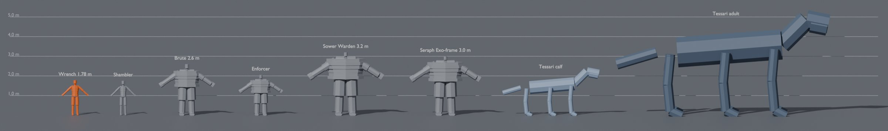

<!-- GENERATED by tools/characters/build.py from tools/characters/catalog/. Do not edit by hand. -->
# 01 — Cast Overview

Every character, creature and enemy in EXODUS PROTOCOL: **70 entries**, **337 Blender assets**, plus 28 kit-built notable survivors and the procedural survivor kit.

*Height lineup: stand-in bodies generated by `tools/blender/exodus_characters.py` from each character's skeleton and height.*

*Scale chart: the player beside a Shambler, a Brute, a Directorate Enforcer, a Sower Warden, the Seraph exo-frame and the Tessari (side view). Same toolkit stand-ins.*

## Budget tiers

| Tier | LOD0 tris | Split | Textures | Facial set | Max influences |
|---|---|---|---|---|---|
| **Hero** | 160,000 | Head 35,000 · Hair 40,000 · Body + outfit 85,000 | Head 4K (BC/N/ORM/SSS + 2 wrinkle normals) · Body 4K · Outfit 2× 4K · Hair 4K · Eyes 2K · Teeth & tongue 1K | hero (80) | 8 |
| **Main** | 110,000 | Head 30,000 · Hair 30,000 · Body + outfit 50,000 | Head 4K (BC/N/ORM/SSS + 1 wrinkle normal) · Body 4K · Outfit 4K · Hair 2K · Eyes 1K | main (68) | 8 |
| **Secondary** | 60,000 | Head 18,000 · Hair 15,000 · Body + outfit 27,000 | Head 2K · Body 2K (shared skin detail) · Outfit 2K · Hair 2K · shared eyes | secondary (56) | 8 |
| **Crowd** | 30,000 | Head 8,000 · Hair 6,000 · Body + outfit 16,000 | Shared 2K head atlases (48 heads) · modular outfit pieces 1K–2K · shared hair atlases | crowd (28) | 4 |
| **Enemy** | 35,000 | Head 6,000 · Bloom growths 9,000 · Body 20,000 | Hollow base 2K (from the survivor body it was) · shared Bloom overlay atlas 2K | hollow (12) | 4 |
| **Elite** | 60,000 | Head 8,000 · Bloom growths 17,000 · Body 35,000 | Unique 4K body set · shared Bloom overlay atlas 2K · 2K plating/growth set | hollow (12) | 4 |
| **Boss** | 180,000 | Head 35,000 · Armor / growths 70,000 · Body 75,000 | Unique 4K sets ×4 (body, armor/growth, head, FX masks) | hero (80) | 8 |
| **Creature-L** | 80,000 | Head 15,000 · Body 65,000 | Body 4K · head 2K · shared Bloom overlay 2K (for Bloom variants) | creature (6) | 4 |
| **Creature-S** | 15,000 | Head 3,000 · Body 12,000 | Body 2K (atlased per kit) | creature (6) | 4 |
| **Hologram** | 20,000 | Form 20,000 | Emissive line atlas 1K · noise mask 512 | none (0) | 4 |

LOD chain: 100% / 50% / 20% / 6% of LOD0.

## PLY — The Player Character

Chapter: [02-player-character.md](02-player-character.md)

| ID | Name | Role | Tier | Size | Skeleton | Assets |
|---|---|---|---|---|---|---|
| PLY-001 | **Wrench (Ren Okafor)** | The Engineer | Hero | 1.78 m tall | EXO_Humanoid (UE5 mannequin-compatible), adult, athletic | 8 |

## CST — Story Cast

Chapter: [03-story-cast.md](03-story-cast.md)

| ID | Name | Role | Tier | Size | Skeleton | Assets |
|---|---|---|---|---|---|---|
| CST-001 | **Ada Okafor** | The Sister | Hero | 1.74 m tall | EXO_Humanoid (UE5 mannequin-compatible), adult, athletic | 9 |
| CST-002 | **Tobias "Tug" Brennan** | The Heart | Main | 1.88 m tall | EXO_Humanoid (UE5 mannequin-compatible), adult, broad / heavy | 6 |
| CST-003 | **Lily Chen** | The Hope | Hero | 1.45 m tall | EXO_Humanoid (UE5 mannequin-compatible), child (8–12) | 7 |
| CST-004 | **Lily Chen (Adult)** | Legacy | Hero | 1.66 m tall | EXO_Humanoid (UE5 mannequin-compatible), adult, athletic | 4 |
| CST-005 | **Dr. Mara Voss** | The Guilt | Main | 1.68 m tall | EXO_Humanoid (UE5 mannequin-compatible), adult, slim | 7 |
| CST-006 | **Sgt. Idris Kaan** | The Soldier | Main | 1.83 m tall | EXO_Humanoid (UE5 mannequin-compatible), adult, athletic | 6 |
| CST-007 | **KESTREL** | The Voice | Hologram | 1.20 m | EXO_Hologram | 4 |
| CST-008 | **Captain Oyelaran "Oye" Adeyemi** | The Rogue | Main | 1.80 m tall | EXO_Humanoid (UE5 mannequin-compatible), adult, average build | 4 |
| CST-009 | **Director Halvard Crane** | The Director | Hero | 1.86 m tall | EXO_Humanoid (UE5 mannequin-compatible), adult, slim | 4 |
| CST-010 | **Mother Sable** | The Listener | Main | 1.63 m tall | EXO_Humanoid (UE5 mannequin-compatible), adult, average build | 4 |
| CST-011 | **Lt. Sana Iqbal** | The Understudy | Secondary | 1.70 m tall | EXO_Humanoid (UE5 mannequin-compatible), adult, average build | 4 |
| CST-012 | **Dana Marsh** | The First Hollow | Secondary | 1.72 m tall | EXO_Humanoid (UE5 mannequin-compatible), adult, athletic | 4 |
| CST-013 | **Ms. Rosa Alvarez** | The Teacher | Secondary | 1.65 m tall | EXO_Humanoid (UE5 mannequin-compatible), adult, average build | 4 |

## NOT — Notable Survivors

Chapter: [04-notable-survivors.md](04-notable-survivors.md)

| ID | Name | Role | Tier | Size | Skeleton | Assets |
|---|---|---|---|---|---|---|
| NOT-001 | **Danny Ruiz** | Diner cook | Secondary | 1.75 m tall | EXO_Humanoid (UE5 mannequin-compatible), adult, broad / heavy | 4 |
| NOT-002 | **Priya Nair** | Air-traffic controller | Secondary | 1.62 m tall | EXO_Humanoid (UE5 mannequin-compatible), adult, slim | 4 |
| NOT-003 | **Walt Hennessey** | Retired astronaut | Secondary | 1.76 m tall | EXO_Humanoid (UE5 mannequin-compatible), elder (stooped posture in animation) | 4 |
| NOT-004 | **Aiyana Two Rivers** | Park ranger | Secondary | 1.69 m tall | EXO_Humanoid (UE5 mannequin-compatible), adult, athletic | 4 |
| NOT-005 | **Marcus Webb** | High-school history teacher | Secondary | 1.85 m tall | EXO_Humanoid (UE5 mannequin-compatible), adult, average build | 4 |
| NOT-006 | **Joel Webb** | ER nurse | Secondary | 1.73 m tall | EXO_Humanoid (UE5 mannequin-compatible), adult, slim | 4 |
| NOT-007 | **Dr. Kenji Mori** | Veterinarian | Secondary | 1.70 m tall | EXO_Humanoid (UE5 mannequin-compatible), adult, average build | 4 |
| NOT-008 | **Rosa Delgado** | Hardware-store owner and welder | Secondary | 1.60 m tall | EXO_Humanoid (UE5 mannequin-compatible), adult, broad / heavy | 4 |
| NOT-009 | **Theo Park** | High-school student and skateboarder | Secondary | 1.72 m tall | EXO_Humanoid (UE5 mannequin-compatible), teen (13–17) | 4 |
| NOT-010 | **Fatima Haddad** | Kestrel radio operator | Secondary | 1.66 m tall | EXO_Humanoid (UE5 mannequin-compatible), adult, slim | 4 |
| NOT-011 | **Maurice "Big Mo" Jackson** | Long-haul trucker | Secondary | 1.93 m tall | EXO_Humanoid (UE5 mannequin-compatible), adult, broad / heavy | 4 |
| NOT-012 | **Hannah Lindqvist** | Mine geologist | Secondary | 1.78 m tall | EXO_Humanoid (UE5 mannequin-compatible), adult, athletic | 4 |

## HOL — Hollows & Sower Constructs

Chapter: [06-hollows-and-constructs.md](06-hollows-and-constructs.md)

| ID | Name | Role | Tier | Size | Skeleton | Assets |
|---|---|---|---|---|---|---|
| HOL-001 | **Shambler** | The common Hollow: slow, relentless, groups up, knocks on doors. | Enemy | 1.75 m tall | EXO_Humanoid (UE5 mannequin-compatible), adult, average build | 6 |
| HOL-002 | **Runner** | Recently turned, fast, leaps; hunts in packs of 3–6. | Enemy | 1.78 m tall | EXO_Humanoid (UE5 mannequin-compatible), adult, athletic | 1 |
| HOL-003 | **Crawler** | Legless Hollow that hides in vents and under vehicles, then ambushes. | Enemy | 1.70 m tall | EXO_Humanoid (UE5 mannequin-compatible), adult, average build | 1 |
| HOL-004 | **Screamer** | Emits a shriek that calls the horde and stuns (1.5 s). | Elite | 1.80 m tall | EXO_Humanoid (UE5 mannequin-compatible), adult, slim | 1 |
| HOL-005 | **Bloater** | Swollen with spores; bursts into a spore cloud when killed. | Elite | 1.76 m tall | EXO_Humanoid (UE5 mannequin-compatible), adult, broad / heavy | 1 |
| HOL-006 | **Brute** | Huge, armored with Bloom plating; targets the weakest load-bearing blo… | Elite | 2.60 m tall | EXO_Humanoid (UE5 mannequin-compatible), hollow brute (overgrown) | 1 |
| HOL-007 | **Drifter** | Zero-G Hollow in an EVA suit; pushes off surfaces to lunge. | Enemy | 1.82 m tall | EXO_Humanoid (UE5 mannequin-compatible), adult, average build | 1 |
| HOL-008 | **Burrower** | Ex-miner Hollow that tunnels and erupts under bases. | Elite | 1.60 m tall | EXO_Humanoid (UE5 mannequin-compatible), adult, broad / heavy | 1 |
| HOL-009 | **Mimic** | Mimics survivor voices and radio calls to lure the player. | Elite | 1.74 m tall | EXO_Humanoid (UE5 mannequin-compatible), adult, average build | 1 |
| HOL-010 | **Husk Titan** | Colossal walking Bloom mass; a planetary event boss. | Boss | 18.00 m tall | EXO_Humanoid (UE5 mannequin-compatible), colossal (husk titan) | 1 |
| HOL-011 | **Stalker** | Bloom-mutated native predator; each planet's predator kit gets a Stalk… | Creature-L | 1.40 m at the shoulder, 3.20 m long | EXO_Quadruped | 1 |
| HOL-012 | **Hive Mite** | Flying spore insect; swarms drain O₂ and clog vents. | Creature-S | 0.06 m at the shoulder, 0.12 m long, 0.16 m wingspan | EXO_Flyer (quadruped + wing chains) | 1 |
| HOL-013 | **Sower Warden** | Ancient precursor construct guarding the Seedship; resonance shield. | Elite | 3.20 m tall | EXO_Humanoid (UE5 mannequin-compatible), exo-frame / construct | 1 |

## FAC — Faction Units

Chapter: [07-faction-units.md](07-faction-units.md)

| ID | Name | Role | Tier | Size | Skeleton | Assets |
|---|---|---|---|---|---|---|
| FAC-001 | **Directorate Trooper** | Ark Directorate. Armored infantry; uses cover, flanks, throws grenades… | Crowd | 1.82 m tall | EXO_Humanoid (UE5 mannequin-compatible), adult, athletic | 4 |
| FAC-002 | **Directorate Enforcer** | Ark Directorate. Heavy armor, riot shield and minigun. | Elite | 2.05 m tall | EXO_Humanoid (UE5 mannequin-compatible), hollow brute (overgrown) | 2 |
| FAC-003 | **Directorate Medic** | Ark Directorate. Revives troopers; priority target. | Crowd | 1.75 m tall | EXO_Humanoid (UE5 mannequin-compatible), adult, average build | 2 |
| FAC-004 | **Directorate Officer** | Ark Directorate. Buffs nearby troops; can be interrogated if subdued. | Secondary | 1.80 m tall | EXO_Humanoid (UE5 mannequin-compatible), adult, average build | 2 |
| FAC-005 | **Directorate Pilot** | Ark Directorate. Shuttle and fighter crews (Seraph crew, Convergence). | Crowd | 1.76 m tall | EXO_Humanoid (UE5 mannequin-compatible), adult, average build | 2 |
| FAC-006 | **Directorate Cleanup Crew** | Ark Directorate. 'Sterilization' teams burning survivors in Act I (M1.… | Crowd | 1.78 m tall | EXO_Humanoid (UE5 mannequin-compatible), adult, average build | 2 |
| FAC-007 | **Directorate Sentinel Drone** | Ark Directorate. Flying spotlight-and-taser drone; alerts troopers. | Creature-S | 0.80 m | EXO_Drone | 2 |
| FAC-008 | **Choir Pilgrim** | The Choir. Choir members: unsettlingly kind; can fight with spore bomb… | Crowd | 1.72 m tall | EXO_Humanoid (UE5 mannequin-compatible), adult, average build | 2 |
| FAC-009 | **Choir Warden** | The Choir. Guards the Cathedral of the Hum. | Secondary | 1.85 m tall | EXO_Humanoid (UE5 mannequin-compatible), adult, broad / heavy | 2 |
| FAC-010 | **Hauler Deckhand** | Free Haulers. Crew of Hauler ships and Tortuga Drift; traders, brawler… | Crowd | 1.78 m tall | EXO_Humanoid (UE5 mannequin-compatible), adult, average build | 2 |
| FAC-011 | **Hauler Trader** | Free Haulers. Market vendors and contract brokers at Tortuga Drift. | Secondary | 1.74 m tall | EXO_Humanoid (UE5 mannequin-compatible), adult, average build | 2 |

## BOS — Bosses

Chapter: [08-bosses.md](08-bosses.md)

| ID | Name | Role | Tier | Size | Skeleton | Assets |
|---|---|---|---|---|---|---|
| BOS-001 | **Ada — Seraph Exo-frame** | M4.03 (if Ada stayed loyal) | Boss | 3.00 m tall | EXO_Humanoid (UE5 mannequin-compatible), exo-frame / construct | 3 |
| BOS-002 | **Crane — The Director** | M4.04 Phase 1 | Boss | 2.05 m tall | EXO_Humanoid (UE5 mannequin-compatible), adult, athletic | 2 |
| BOS-003 | **Crane — The Graft** | M4.04 Phase 2 | Boss | 2.40 m tall | EXO_Humanoid (UE5 mannequin-compatible), hollow brute (overgrown) | 2 |
| BOS-004 | **Crane — The Bonsai** | M4.04 Phase 3 | Boss | 12.00 m tall | EXO_Humanoid (UE5 mannequin-compatible), colossal (husk titan) | 2 |

## CRE — Creatures & Fauna

Chapter: [09-creatures-and-fauna.md](09-creatures-and-fauna.md)

| ID | Name | Role | Tier | Size | Skeleton | Assets |
|---|---|---|---|---|---|---|
| CRE-001 | **Tessari (Adult)** | Gentle six-limbed megafauna native to Veyra-4, dying under the Garden … | Creature-L | 3.60 m at the shoulder, 7.00 m long | EXO_Hexapod | 2 |
| CRE-002 | **Tessari (Calf)** | Young Tessari: follows the player once healed, lives in the Livestock … | Creature-L | 1.60 m at the shoulder, 3.00 m long | EXO_Hexapod | 1 |
| CRE-003 | **Dog** | Township strays fed by Danny; become colony pets (Hearthside update). | Creature-S | 0.55 m at the shoulder, 0.95 m long | EXO_Quadruped | 4 |
| CRE-004 | **Coyote** | Kestrel Valley wildlife; its Bloom variant is Earth's Stalker equivale… | Creature-S | 0.60 m at the shoulder, 1.10 m long | EXO_Quadruped | 2 |
| CRE-005 | **Crow** | Ambient Earth bird; flocks mark carrion and Hollow activity (a readabl… | Creature-S | 0.12 m at the shoulder, 0.35 m long, 0.80 m wingspan | EXO_Flyer (quadruped + wing chains) | 1 |
| CRE-006 | **Jackrabbit** | Ambient wildlife and early food source (Jackrabbit Flats). | Creature-S | 0.25 m at the shoulder, 0.50 m long | EXO_Quadruped | 1 |
| CRE-007 | **Wild Horse** | Feral horses in Kestrel Valley; can be tamed as mounts in the post-lau… | Creature-L | 1.50 m at the shoulder, 2.40 m long | EXO_Quadruped | 1 |
| CRE-008 | **Fauna Kit — Grazer** | Herd herbivores of Drift planets. | Creature-L | 1.80 m at the shoulder, 3.50 m long | EXO_Quadruped | 41 |
| CRE-009 | **Fauna Kit — Predator** | Drift predators; each has a Bloom 'Stalker' variant. | Creature-L | 1.40 m at the shoulder, 3.20 m long | EXO_Quadruped | 34 |
| CRE-010 | **Fauna Kit — Flyer** | Birds, gliders and sky-rays. | Creature-L | 0.60 m at the shoulder, 1.40 m long, 3.20 m wingspan | EXO_Flyer (quadruped + wing chains) | 28 |
| CRE-011 | **Fauna Kit — Burrower** | Serpentine diggers and sand-swimmers. | Creature-L | 4.00 m long | EXO_Serpentine | 19 |
| CRE-012 | **Fauna Kit — Hexapod** | Six-limbed species (Tessari cousins) and large insects. | Creature-L | 1.20 m at the shoulder, 2.50 m long | EXO_Hexapod | 23 |
| CRE-013 | **Gorgonopsid (Permian)** | Permian predator seen in Memory Garden 4, covered in the Bloom of the … | Creature-L | 0.90 m at the shoulder, 3.00 m long | EXO_Quadruped | 2 |
| CRE-014 | **Dicynodont (Permian)** | Permian grazer in Memory Garden 4; herds dying in the burning sky. | Creature-L | 0.80 m at the shoulder, 2.50 m long | EXO_Quadruped | 2 |
| CRE-015 | **Drowned Choir Singer** | The whale-like people the Sowers harvested before they understood; see… | Creature-L | 22.0 m long, 5.0 m girth | EXO_Cetacean | 1 |
| CRE-016 | **Sower Echo** | A memory of a Sower in the First Garden (M4.02): tall, luminous beings… | Secondary | 2.80 m tall | EXO_Humanoid (UE5 mannequin-compatible), adult, slim | 1 |

## Height chart (humanoid cast)

| Name | Height | Proportions |
|---|---|---|
| Maurice "Big Mo" Jackson | 1.93 m | Adult, broad / heavy |
| Tobias "Tug" Brennan | 1.88 m | Adult, broad / heavy |
| Director Halvard Crane | 1.86 m | Adult, slim |
| Marcus Webb | 1.85 m | Adult, average build |
| Sgt. Idris Kaan | 1.83 m | Adult, athletic |
| Captain Oyelaran "Oye" Adeyemi | 1.80 m | Adult, average build |
| Wrench (Ren Okafor) | 1.78 m | Adult, athletic |
| Hannah Lindqvist | 1.78 m | Adult, athletic |
| Walt Hennessey | 1.76 m | Elder (stooped posture in animation) |
| Danny Ruiz | 1.75 m | Adult, broad / heavy |
| Ada Okafor | 1.74 m | Adult, athletic |
| Joel Webb | 1.73 m | Adult, slim |
| Dana Marsh | 1.72 m | Adult, athletic |
| Theo Park | 1.72 m | Teen (13–17) |
| Lt. Sana Iqbal | 1.70 m | Adult, average build |
| Dr. Kenji Mori | 1.70 m | Adult, average build |
| Aiyana Two Rivers | 1.69 m | Adult, athletic |
| Dr. Mara Voss | 1.68 m | Adult, slim |
| Lily Chen (Adult) | 1.66 m | Adult, athletic |
| Fatima Haddad | 1.66 m | Adult, slim |
| Ms. Rosa Alvarez | 1.65 m | Adult, average build |
| Mother Sable | 1.63 m | Adult, average build |
| Priya Nair | 1.62 m | Adult, slim |
| Rosa Delgado | 1.60 m | Adult, broad / heavy |
| Lily Chen | 1.45 m | Child (8–12) |

