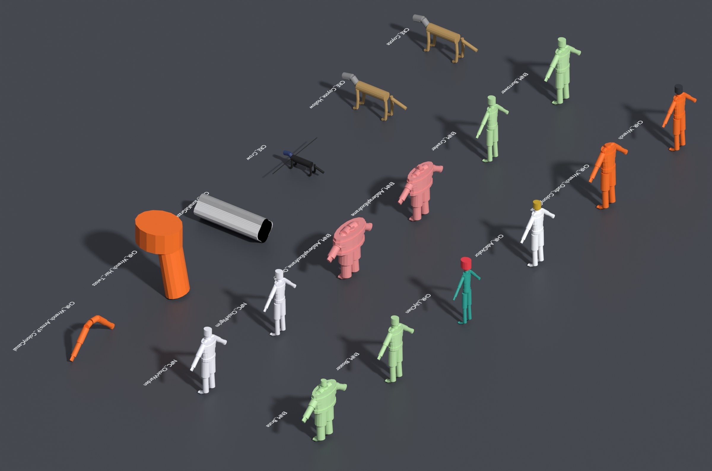

# 12 — Blender Character Toolkit

> `tools/blender/exodus_characters.py` turns every character card into a rigged Blender file, builds a complete greybox of every character asset, checks work against its tier budgets and rig rules, and exports it for the engine. Tested with Blender 4.2 (the `bpy` 4.2 module).

**Every character is already built.** `assets/characters/` holds a validated greybox `.blend` for every asset: all 223 catalog assets (197 per-character files, 21 creature kit families and 5 pattern-mask sheets), the 28 kit-built notables' signature pieces and the 16 survivor-kit families. That's **267 files, 267 / 267 PASS** with no warnings. Artists replace the greybox meshes and keep the rig, sockets, shape-key names and object names.



*Built greyboxes (sizes normalized for the sheet): the player with an outfit shell, hair and first-person arms; story cast, notable survivors and faction units; Hollows and bosses; creatures, and a creature kit family.*

## 12.1 Pipeline

```
 tools/characters/catalog/*.py  +  tools/characters/skeletons.py
        │  python3 tools/characters/build.py
        ▼
 docs/character-bible/*.md  +  data/characters.json  +  data/art_tracker_characters.csv
        │  exodus_characters.py scaffold
        ▼
 assets/characters/<chapter>/<asset>.blend   ← model, sculpt, skin, shape keys
        │  exodus_characters.py validate   (repeat until PASS)
        ▼
 exodus_characters.py export  →  export/characters/<chapter>/<asset>.fbx (+ _LOD1–3.fbx, .meta.json)
```

## 12.2 Commands
Run from the repository root.

| Task | Command |
|---|---|
| Scaffold every asset of a character | `blender -b -P tools/blender/exodus_characters.py -- scaffold --character CST-001` |
| Scaffold one asset | `… -- scaffold --asset SK_CHR_AdaOkafor_Outfit_FlightSuit` |
| Scaffold a group | `… -- scaffold --group HOL CRE` |
| Scaffold everything | `… -- scaffold --all` |
| **Build everything** (greybox: 267 files, about 1 min) | `… -- build --all` |
| Build one character / asset / group | `… -- build --character CST-001` · `--asset …` · `--group HOL CRE` |
| Build the signature pieces and survivor kit only | `… -- build --extras` |
| Overwrite an existing file | add `--force` (off by default) |
| Validate | `… -- validate assets/characters/story-cast/SK_CHR_AdaOkafor.blend` |
| Export (validates first) | `… -- export assets/characters/story-cast/SK_CHR_AdaOkafor.blend` |
| List assets and budgets | `… -- list --group CST` |

Also runs with the stand-alone `bpy` module: `python tools/blender/exodus_characters.py scaffold --character PLY-001`.

## 12.3 What the scaffold creates

| Item | Details |
|---|---|
| **Armature** | Object `Armature` built from the character's skeleton template at its exact height and proportion profile (74 bones for humanoids, UE5 names, A-pose), with metadata custom properties (character, tier, budgets, influences, facial set, skeleton spec) |
| **Stand-in body** (base and variant files) | `<asset>_LOD0` (body) and `<asset>_Head_LOD0` (head): an octagonal-prism stand-in for each bone at the character's proportions, **already skinned** (rigid weights), with UV0 and UV1 and a group-colored blockout material. It can be exported and tested in engine from minute one. |
| **Reference body** (outfit, hair and 1P-arm files) | `REF_<asset>_Body` wireframe on the same rig, so the piece is modeled and skinned in place |
| **LOD collections** | `<asset>_LOD0…3` |
| **Sockets** | The 10 humanoid sockets (weapon, back, hips, helmet, lights, wrist pad, first-person camera), parented to their bones |
| **Turnaround** | Orthographic `REF_Cam_Front`, `Side`, `Back`, `ThreeQuarter` framed to the character, a height bar and a 1.8 m reference human |
| **Notes** | Text block `EXODUS_NOTES` with the card: role, visual design, budgets, textures, facial set and notes |

Creature-kit module families (e.g. `SK_CRE_FaunaKitGrazer_Heads_##`) are authored in one kit file per family, so the scaffold skips them.

## 12.3a What `build` adds
`scaffold` makes a starter file with a stand-in body. `build` makes the complete greybox:

| Asset kind | Greybox |
|---|---|
| **Base / Variant** | Skinned body and head meshes for LOD0–3. Each LOD is coarser than the last (16-sided prisms at LOD0 down to 5–6 at LOD3) and within its budget. The base head carries **every shape key of the character's facial set** (80 for heroes: ARKit 52 plus EXODUS correctives, down to 6 for creatures), each moving its region of the face, so facial rigs and capture retargeting can be wired and tested now. |
| **Outfit** | A shell over the body, thicker for armor, suits, coats, hazmat and exo-frames, skinned to the same bones |
| **Hair** | A cap shell on the head bone, plus a fall behind the neck for long, braided or tied styles, or a lower-face shell for beards and stubble |
| **1P arms** | Clavicle-to-hand shells for the first-person camera |
| **Creature kit families** (`SK_CRE_FaunaKit*_##`) | One file per family with **every variant** (`<family>_NN_LOD0–3`) on the shared rig; variants differ in bulk; horns, crests, spines and plates are small shells |
| **Pattern-mask sheets** (`T_CRE_FaunaKit*_PatternMasks`) | Every mask (stripes, spots, bands, mottling) generated at 256² and packed into the file; `export` writes them as PNGs |
| **Signature pieces** (28 kit-built notables) | A body shell on the survivor's preset (adult, elder, teen), at the crowd budget |
| **Survivor kit** (16 families) | Bodies (adult, elder, teen, child), 48 heads with the 28-shape crowd facial set, 40 hairstyles, 14 beards, 18 headwear pieces, 138 outfit pieces by origin, 40 accessories and 30 prosthetics, all skinned to the humanoid rig |
| **Materials** | `MI_<SET>_Greybox_<GROUP>_<ID>_<Slot>` in the character's palette colors (holograms are emissive) |

## 12.4 Validation rules

| Check | Result |
|---|---|
| One armature named `Armature`, at the origin, with EXODUS metadata | **Error** |
| Metric units, scale 1.0 | **Error** |
| Every template bone present with the right deform flag | **Error**; extra bones without an approved prefix: warning |
| Humanoid crown height within ±2% of the catalog | **Error** |
| LOD0 has at least one mesh | **Error** (LOD1–3 empty: warning) |
| Triangles per LOD within budget | > +10%: **error**; ≤ 10% over: warning |
| Meshes parented to `Armature` with an Armature modifier; transforms applied | **Error** |
| UV map present; `MI_*` materials | **Error**; blockout material left on LOD0: warning |
| No unweighted vertices; ≤ tier max influences | **Error**; weights not normalized: warning |
| Polygons with more than 4 sides | Warning (tangent-space export) |
| Facial shape keys for the tier set on the base head | Warning until complete; shape keys that don't move anything: warning |
| Kit families: budgets are per variant × variant count | As above |
| Pattern-mask sheets: every mask packed | **Error** |
| Naming convention | Warning |

`validate` exits with code 1 if any file has errors, so it can run in CI.

## 12.5 Export
Writes `<asset>.fbx` (LOD0 with the armature), `<asset>_LOD1–3.fbx`, and `<asset>.meta.json` (metadata, sockets with their bones, shape-key lists). Kit families drop the `_##` from file names; pattern-mask sheets export one PNG per mask. All 267 built files export (1,156 files for the 223 catalog assets). FBX settings: armature + mesh, all bones (including non-deform `ik_*`), no leaf bones, no animation, unit scale applied, tangent space on. Animations are exported separately, with matching settings, by the [Procedural Animation Toolkit](13-procedural-animation-toolkit.md).

## 12.6 Production tracking
`data/art_tracker_characters.csv` lists every character asset (plus the 28 signature pieces) with type, tier, skeleton, size, LOD budgets, textures, facial set, capture flag, path, `status`, `owner` and `notes`. `status` is filled in by `tools/characters/build.py`: **Greybox built** when the file exists (every row today). Suggested statuses after greybox: *Concept → Sculpt → Retopo → UV/Texture → Rig & skin → Shape keys → LODs → Validated → In engine → Done*.

**Suggested order** (matches the vertical slice, game bible 15): Wrench (+ 1P arms) → Dana Marsh and her Hollow form (the Hollow benchmark) → Tug → Lily → the survivor kit's first 12 heads → Shambler conversions → Ada.

## 12.7 Adding or changing a character
1. Add a `CH(...)` entry in the right module in `tools/characters/catalog/` (new entries go at the **end** of their group to keep IDs stable).
2. Run `python3 tools/characters/build.py`: it validates the catalog and regenerates the chapters, JSON and tracker.
3. Build: `blender -b -P tools/blender/exodus_characters.py -- build --character <ID>` (or `scaffold` for a starter file only), then rerun `build.py` so the tracker shows it as built.
4. If a character's height or skeleton changes, `validate` flags existing files. Re-scaffold with `--force` into a clean file and transfer the work.
