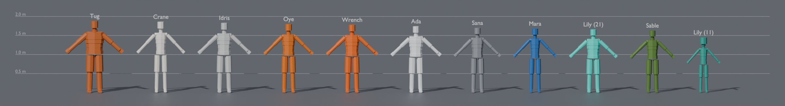

# EXODUS PROTOCOL — Character Bible

> Every person, Hollow, boss and creature in the game: story profile, visual design, wardrobe by act, and a **Blender production spec for every asset**, plus a Blender toolkit. **Every character asset is built** as a validated, rigged greybox in `assets/characters/` (267 files). Companion to the [Game Bible](../game-bible/README.md) (story and characters: chapters 03, 04, 17) the [Parts Bible](../parts-bible/README.md) (suits, weapons and props) and the [Level Design Bible](../level-bible/README.md) (where each character appears, navigation agents and encounter spaces).

<!-- STATS:START -->
| | Count |
|---|---|
| The Player Character | 1 entry · 8 assets |
| Story Cast | 13 entries · 67 assets |
| Notable Survivors | 12 entries · 48 assets |
| Hollows & Sower Constructs | 13 entries · 18 assets |
| Faction Units | 11 entries · 24 assets |
| Bosses | 4 entries · 9 assets |
| Creatures & Fauna | 16 entries · 163 assets |
| Text-and-bark notables (kit-built) | 28 (one signature piece each) |
| Procedural survivor kit | 302 kit meshes |
| **Total Blender assets** | **667** |
<!-- STATS:END -->

## How to use this bible
- **Writers & directors:** each story card carries the character's want, need, wound and lie, their arc, voice and acting notes, consistent with game bible chapter 04.
- **Concept & 3D artists:** each card has silhouette, face, hair, body, marks, palette (hex), signature props and a wardrobe table with every outfit by act. Below that are the Blender assets with budgets for LOD0–3, skeleton, facial rig set, textures, weights, hair, cloth, sockets and notes. Start with [00 — Character Art & Blender Standards](00-character-art-standards.md), then open the asset's built greybox in `assets/characters/` and replace it with final art (see the [toolkit](12-blender-character-toolkit.md)).
- **Riggers & animators:** [10 — Skeletons, Rigging & Facial](10-skeletons-rigging-and-facial.md) has every skeleton template, the full humanoid bone list, sockets and the exact shape-key names; [11](11-animation-and-performance-capture.md) covers animation sets and the capture plan. Until capture lands, every body has a generated greybox animation set in `assets/animations/` (see [13](13-procedural-animation-toolkit.md)).
- **Producers:** `data/art_tracker_characters.csv` is the character art backlog (one row per asset).
- **Engineers:** `data/characters.json` and `data/skeletons.json` are the machine-readable registry.

## Chapters

| # | Chapter | Contents |
|---|---|---|
| 00 | [Character Art & Blender Standards](00-character-art-standards.md) | Art direction, units and axes, tiers, naming, collections, heads, outfits, hair, skin, infection stages, Hollow conversion, first-person arms, definition of done |
| 01 | [Cast Overview](01-cast-overview.md) | Every entry in one list, budget tiers, height chart, lineup and scale renders |
| 02 | [The Player Character](02-player-character.md) | Wrench: story, design, wardrobe, character creator, first-person arms |
| 03 | [Story Cast](03-story-cast.md) | Ada, Tug, Lily (11 and 21), Mara, Idris, KESTREL, Oye, Crane, Sable, Sana Iqbal, Dana Marsh, Ms. Alvarez; portrait-only characters |
| 04 | [Notable Survivors](04-notable-survivors.md) | 12 voiced notables with full sheets + 28 text-and-bark notables |
| 05 | [Procedural Survivors (Kit)](05-procedural-survivors.md) | Bodies, 48 heads, hair, outfit pieces by origin, accessories, rules |
| 06 | [Hollows & Sower Constructs](06-hollows-and-constructs.md) | The full bestiary with gameplay stats, Bloom design, weak points, motion and audio |
| 07 | [Faction Units](07-faction-units.md) | Directorate, Choir and Hauler units |
| 08 | [Bosses](08-bosses.md) | Ada's Seraph exo-frame; Crane's three forms |
| 09 | [Creatures & Fauna](09-creatures-and-fauna.md) | Tessari, Earth wildlife, Drift fauna kits, memory-garden creatures |
| 10 | [Skeletons, Rigging & Facial](10-skeletons-rigging-and-facial.md) | Templates, proportion profiles, bone list, sockets, facial shape-key sets, infection shapes |
| 11 | [Animation & Performance Capture](11-animation-and-performance-capture.md) | Shared and signature animation sets, Hollow motion, capture plan |
| 12 | [Blender Character Toolkit](12-blender-character-toolkit.md) | Build (full greybox of every asset), scaffold, validate and export; tracking; adding characters |
| 13 | [Procedural Animation Toolkit](13-procedural-animation-toolkit.md) | Greybox animation sets for all 93 bodies: build, validate, export; clip lists; the Unreal slice hookup |

## Source of truth
Chapters 01–10 and `data/` are **generated** by `python3 tools/characters/build.py` from `tools/characters/catalog/` and `tools/characters/skeletons.py`. Chapters 00, 11, 12 and 13 and this README are hand-written; the counts above refresh on each build.

## Conventions in one breath
Characters face −Y, up +Z, left +X · A-pose · crown of the head at the catalog height · UE5 mannequin bone names · one `Armature` per file · assets `SK_CHR_ / SK_NPC_ / SK_ENM_ / SK_CRE_` · facial shapes on `_Head_` meshes with exact ARKit names · no gore, no child Hollows.
