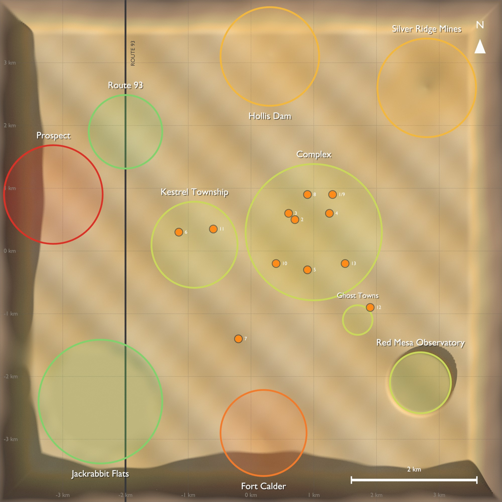
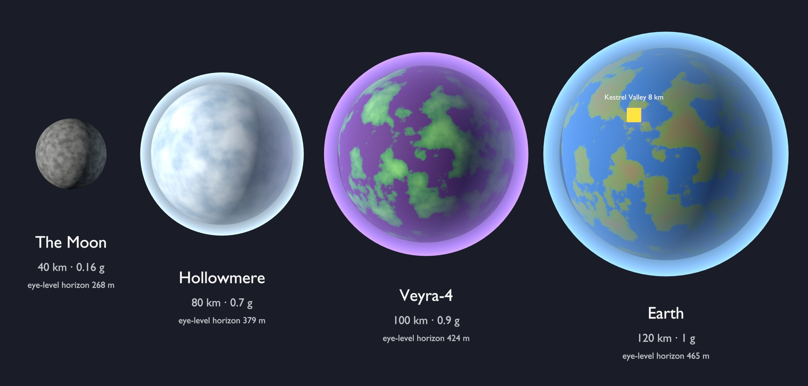

<!-- GENERATED by tools/levels/build.py from tools/levels/catalog/. Do not edit by hand. -->
# 01 — Level Overview

Every level in EXODUS PROTOCOL: **63 levels** across planets, open regions, districts, mission spaces, hubs, dungeons, space arenas and procedural templates.

*Kestrel Valley district map, generated by the Blender level toolkit from the catalog (8 × 8 km; 256 m streaming grid).*

*Planets at voxel-traversal scale (20–120 km), generated by the toolkit.*

## Level types & budgets

| Type | Streaming | Blockout tris | Memory | Draw calls | Shadow lights |
|---|---|---|---|---|---|
| **Open Region** | 256 m cells, 768 m range | 50,000 per cell | 60 MB per cell | 400 per cell | 4 |
| **Planet Region** | 512 m cells, 1,536 m range | 40,000 per cell | 40 MB per cell | 300 per cell | 2 |
| **Space Region** | 2,048 m cells, 8,192 m range | 20,000 per cell | 20 MB per cell | 150 per cell | 1 |
| **District** | Level instance | 400,000 | 350 MB | 2,500 | 12 |
| **Interior** | Level instance | 200,000 | 400 MB | 3,000 | 16 |
| **Hub** | Level instance | 300,000 | 600 MB | 4,000 | 24 |
| **Dungeon** | Level instance | 250,000 | 500 MB | 3,500 | 20 |
| **Set Piece** | Level instance | 150,000 | 350 MB | 2,500 | 16 |
| **Space Arena** | Level instance | 100,000 | 300 MB | 2,000 | 8 |
| **Procedural Template** | Level instance | 80,000 | 120 MB | 1,200 | 8 |
| **Planet** | Voxel clipmap | 400,000 | 900 MB | 3,000 | 4 |

## PLN — Planets & Voxel Scale

Chapter: [03-planets-and-voxel-scale.md](03-planets-and-voxel-scale.md)

| ID | Level | Type | Act | Missions | Size |
|---|---|---|---|---|---|
| PLN-001 | **Earth (starter planet)** | Planet | I (Kestrel Valley), II+ (Earth Returns) | — | 120.0 km × 120.0 km × 120.0 km |
| PLN-002 | **The Moon** | Planet | II | — | 40.0 km × 40.0 km × 40.0 km |
| PLN-003 | **Veyra-4** | Planet | III | — | 100.0 km × 100.0 km × 100.0 km |
| PLN-004 | **Hollowmere** | Planet | III | — | 80.0 km × 80.0 km × 80.0 km |
| PLN-005 | **Drift Planet (procedural)** | Planet | III+ | — | 120.0 km × 120.0 km × 120.0 km |

## KVL — Kestrel Valley — Open Region & Districts

Chapter: [04-kestrel-valley.md](04-kestrel-valley.md)

| ID | Level | Type | Act | Missions | Size |
|---|---|---|---|---|---|
| KVL-001 | **Kestrel Valley** | Open Region | I (open from 0:30) + Earth Returns | M1.01–M1.07, Earth Returns side content | 8,000 m × 8,000 m × 700 m (64 km²) |
| KVL-002 | **Kestrel Aerospace Complex** | District | I (open world) | M0.01–M0.03, M1.01, M1.04–M1.07 | 2,200 m × 2,200 m × 150 m |
| KVL-003 | **Kestrel Township** | District | I (open world) | M1.02, M1.05 (warehouse) | 1,400 m × 1,400 m × 150 m |
| KVL-004 | **Route 93 & the Truck Stop** | District | I (open world) | — | 1,200 m × 1,200 m × 150 m |
| KVL-005 | **Jackrabbit Flats** | District | I (open world) | — | 2,000 m × 2,000 m × 150 m |
| KVL-006 | **Hollis Dam & Reservoir** | District | I (open world) | — | 1,600 m × 1,600 m × 150 m |
| KVL-007 | **Silver Ridge Mines** | District | I (open world) | — | 1,600 m × 1,600 m × 150 m |
| KVL-008 | **Red Mesa Observatory** | District | I (open world) | — | 1,000 m × 1,000 m × 150 m |
| KVL-009 | **Fort Calder** | District | I (open world) | — | 1,400 m × 1,400 m × 150 m |
| KVL-010 | **Prospect (City Edge)** | District | I (open world) | — | 1,600 m × 1,600 m × 150 m |
| KVL-011 | **Ghost Towns** | District | I (open world) | — | 500 m × 500 m × 150 m |

## KES — Kestrel Complex & Township — Mission Spaces

Chapter: [05-kestrel-complex-and-township.md](05-kestrel-complex-and-township.md)

| ID | Level | Type | Act | Missions | Size |
|---|---|---|---|---|---|
| KES-001 | **Mission Control 2068** | Set Piece | Cold Open | Cold Open | 30 m × 20 m × 6 m |
| KES-002 | **Hangar 4** | Hub | Prologue–I | M0.01, M0.03 (end), M1.01, M1.06 | 60 m × 40 m × 20 m |
| KES-003 | **Service Corridors** | Interior | Prologue | M0.02 | 120 m × 40 m × 6 m |
| KES-004 | **Terminal B** | Set Piece | Prologue | M0.03 | 180 m × 60 m × 18 m |
| KES-005 | **Pad 12** | Set Piece | Prologue | M0.03 | 200 m × 150 m × 40 m |
| KES-006 | **Kestrel Elementary** | Interior | I | M1.02 | 70 m × 50 m × 10 m |
| KES-007 | **Ark Transport Crash Site** | Set Piece | I | M1.03 | 150 m × 150 m × 30 m |
| KES-008 | **The Vault** | Dungeon | I | M1.04 | 90 m × 90 m × 24 m |
| KES-009 | **Mission Control Tower** | Interior | I | M1.05 (Guidance Computer) | 40 m × 40 m × 60 m |
| KES-010 | **Fuel Farm** | Set Piece | I | M1.05 (Fuel) | 300 m × 200 m × 25 m |
| KES-011 | **Township Warehouse** | Interior | I | M1.05 (Heat Shield Tiles) | 120 m × 110 m × 12 m |
| KES-012 | **Crashed Ark Shuttle** | Set Piece | I | M1.05 (Life Support) | 120 m × 120 m × 20 m |
| KES-013 | **Pad 39-K** | Set Piece | I | M1.06, M1.07 | 250 m × 250 m × 110 m |

## ORB — Orbit & the Moon

Chapter: [06-orbit-and-the-moon.md](06-orbit-and-the-moon.md)

| ID | Level | Type | Act | Missions | Size |
|---|---|---|---|---|---|
| ORB-001 | **Low Earth Orbit** | Space Region | II+ | — | 200.0 km × 200.0 km × 100.0 km |
| ORB-002 | **Haven-9 Station** | Hub | II (and the colony's home until Act III) | M2.01, M2.02, M2.03, M2.05, M2.06 | 120 m × 80 m × 30 m |
| ORB-003 | **Lunar Near Side** | Planet Region | II | M2.04 | 10.0 km × 10.0 km × 1,200 m |
| ORB-004 | **Tycho Outpost** | Interior | II | M2.04 | 120 m × 90 m × 25 m |
| ORB-005 | **Styx Wreck** | Dungeon | II | M2.07 | 2,200 m × 900 m × 900 m |

## DRF — The Drift

Chapter: [07-the-drift.md](07-the-drift.md)

| ID | Level | Type | Act | Missions | Size |
|---|---|---|---|---|---|
| DRF-001 | **Tortuga Drift** | Hub | III | M3.02 | 1,500 m × 1,500 m × 600 m |
| DRF-002 | **The Dust Queen** | Dungeon | III | M3.02 (Oye's favor) | 180 m × 60 m × 40 m |
| DRF-003 | **Veyra-4 Jungle Region** | Planet Region | III | M3.03 | 16.0 km × 16.0 km × 2,500 m |
| DRF-004 | **The Garden Engine** | Dungeon | III | M3.03 | 400 m × 400 m × 2,000 m |
| DRF-005 | **Cathedral of the Hum** | Hub | III | M3.04 | 300 m × 700 m × 80 m |
| DRF-006 | **Ark Meridian** | Dungeon | III | M3.07 | 600 m × 300 m × 120 m |
| DRF-007 | **Convergence Gate** | Space Arena | III | M3.08 | 40.0 km × 40.0 km × 20.0 km |

## SEE — The Seedship Anthesis

Chapter: [08-the-seedship-anthesis.md](08-the-seedship-anthesis.md)

| ID | Level | Type | Act | Missions | Size |
|---|---|---|---|---|---|
| SEE-001 | **Anthesis Approach** | Space Arena | IV | M4.01 | 60.0 km × 60.0 km × 40.0 km |
| SEE-002 | **The Living Halls** | Hub | IV | M4.02 (hub) | 800 m × 800 m × 300 m |
| SEE-003 | **Memory Garden 1 — Veyra, Before** | Dungeon | IV | M4.02 | 1,200 m × 1,200 m × 400 m |
| SEE-004 | **Memory Garden 2 — The Drowned Choir** | Dungeon | IV | M4.02 | 1,200 m × 1,200 m × 600 m |
| SEE-005 | **Memory Garden 3 — The First Garden** | Dungeon | IV | M4.02 | 1,000 m × 1,000 m × 500 m |
| SEE-006 | **Memory Garden 4 — Permian Earth** | Dungeon | IV | M4.02 | 1,500 m × 1,500 m × 400 m |
| SEE-007 | **The Living Bridges** | Set Piece | IV | M4.03 | 400 m × 600 m × 300 m |
| SEE-008 | **The Loom Chamber** | Set Piece | IV | M4.04 (phases 1–2), M4.05 | 200 m × 200 m × 120 m |
| SEE-009 | **Bonsai Mind-Space** | Set Piece | IV | M4.04 (phase 3) | 600 m × 600 m × 500 m |
| SEE-010 | **The Last Sunday Dinner** | Set Piece | Epilogue | M4.06 | 30 m × 20 m × 6 m |

## PRC — Procedural Templates

Chapter: [09-procedural-templates.md](09-procedural-templates.md)

| ID | Level | Type | Act | Missions | Size |
|---|---|---|---|---|---|
| PRC-001 | **Derelict Ship** | Procedural Template | II+ (open world) | — | 140 m × 50 m × 30 m |
| PRC-002 | **Crash Site** | Procedural Template | II+ (open world) | — | 120 m × 120 m × 25 m |
| PRC-003 | **Survivor Camp** | Procedural Template | II+ (open world) | — | 100 m × 80 m × 15 m |
| PRC-004 | **Bloom Heart** | Procedural Template | II+ (open world) | — | 80 m × 80 m × 40 m |
| PRC-005 | **Sower Ruin** | Procedural Template | II+ (open world) | — | 120 m × 120 m × 60 m |
| PRC-006 | **Directorate Outpost** | Procedural Template | II+ (open world) | — | 150 m × 120 m × 25 m |
| PRC-007 | **Choir Shrine** | Procedural Template | II+ (open world) | — | 60 m × 60 m × 20 m |
| PRC-008 | **Hauler Waystation** | Procedural Template | II+ (open world) | — | 120 m × 100 m × 30 m |
| PRC-009 | **Anomaly** | Procedural Template | II+ (open world) | — | 200 m × 200 m × 100 m |
| PRC-010 | **Wonders** | Procedural Template | III+ | — | 5,000 m × 5,000 m × 3,000 m |
| PRC-011 | **Earth Returns Region** | Open Region | II+ | — | 8,000 m × 8,000 m × 1,500 m |
| PRC-012 | **Player Base Zones** | Procedural Template | All | — | 400 m × 400 m × 120 m |

## Mission → level index

| Mission | Level |
|---|---|
| Earth Returns side content | KVL-001 Kestrel Valley |
| Cold Open | KES-001 Mission Control 2068 |
| M0.01 | KES-002 Hangar 4 |
| M0.01–M0.03 | KVL-002 Kestrel Aerospace Complex |
| M0.02 | KES-003 Service Corridors |
| M0.03 | KES-004 Terminal B |
| M0.03 | KES-005 Pad 12 |
| M0.03 (end) | KES-002 Hangar 4 |
| M1.01 | KVL-002 Kestrel Aerospace Complex |
| M1.01 | KES-002 Hangar 4 |
| M1.01–M1.07 | KVL-001 Kestrel Valley |
| M1.02 | KVL-003 Kestrel Township |
| M1.02 | KES-006 Kestrel Elementary |
| M1.03 | KES-007 Ark Transport Crash Site |
| M1.04 | KES-008 The Vault |
| M1.04–M1.07 | KVL-002 Kestrel Aerospace Complex |
| M1.05 (Fuel) | KES-010 Fuel Farm |
| M1.05 (Guidance Computer) | KES-009 Mission Control Tower |
| M1.05 (Heat Shield Tiles) | KES-011 Township Warehouse |
| M1.05 (Life Support) | KES-012 Crashed Ark Shuttle |
| M1.05 (warehouse) | KVL-003 Kestrel Township |
| M1.06 | KES-002 Hangar 4 |
| M1.06 | KES-013 Pad 39-K |
| M1.07 | KES-013 Pad 39-K |
| M2.01 | ORB-002 Haven-9 Station |
| M2.02 | ORB-002 Haven-9 Station |
| M2.03 | ORB-002 Haven-9 Station |
| M2.04 | ORB-003 Lunar Near Side |
| M2.04 | ORB-004 Tycho Outpost |
| M2.05 | ORB-002 Haven-9 Station |
| M2.06 | ORB-002 Haven-9 Station |
| M2.07 | ORB-005 Styx Wreck |
| M3.02 | DRF-001 Tortuga Drift |
| M3.02 (Oye's favor) | DRF-002 The Dust Queen |
| M3.03 | DRF-003 Veyra-4 Jungle Region |
| M3.03 | DRF-004 The Garden Engine |
| M3.04 | DRF-005 Cathedral of the Hum |
| M3.07 | DRF-006 Ark Meridian |
| M3.08 | DRF-007 Convergence Gate |
| M4.01 | SEE-001 Anthesis Approach |
| M4.02 | SEE-003 Memory Garden 1 — Veyra, Before |
| M4.02 | SEE-004 Memory Garden 2 — The Drowned Choir |
| M4.02 | SEE-005 Memory Garden 3 — The First Garden |
| M4.02 | SEE-006 Memory Garden 4 — Permian Earth |
| M4.02 (hub) | SEE-002 The Living Halls |
| M4.03 | SEE-007 The Living Bridges |
| M4.04 (phase 3) | SEE-009 Bonsai Mind-Space |
| M4.04 (phases 1–2) | SEE-008 The Loom Chamber |
| M4.05 | SEE-008 The Loom Chamber |
| M4.06 | SEE-010 The Last Sunday Dinner |

