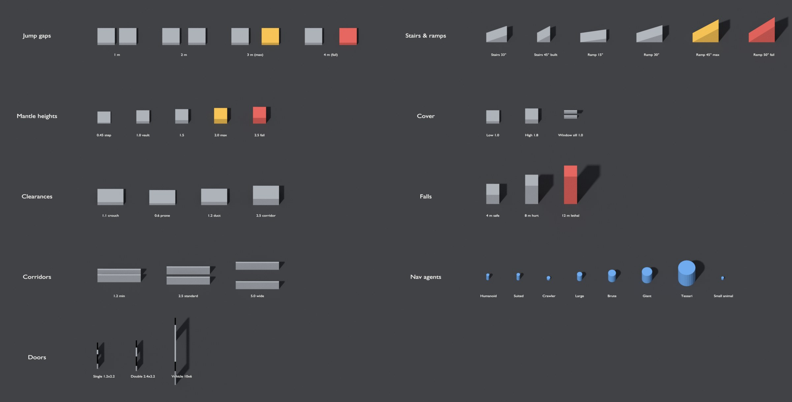

# 15 — Blender Level Toolkit

> `tools/blender/exodus_levels.py` turns every level card in this bible into a Blender blockout file, builds planets at true scale with their transition shells, generates the Metrics Gym and the modular kit libraries, validates everything, and exports geometry plus a markers sidecar for the engine. Tested with Blender 4.2 (the `bpy` 4.2 module).

**Every level is already built.** `assets/levels/` holds a validated blockout of all 63 levels (including the 5 planets and their cube-face map templates), the Metrics Gym and the 13 kit libraries: **77 files, 77 / 77 PASS**.


*Kestrel Valley from its scaffold: 8 km terrain with the mountain rim, 10 districts (ring color = Bloom level, green → red), Route 93, and the Kestrel mission spaces (orange dots, numbered by KES ID). The 1 km grid and 2 km scale bar are for reading only.*

## 15.1 Pipeline at a glance

```
 catalog (tools/levels/catalog/*.py)
        │  python3 tools/levels/build.py
        ▼
 docs/level-bible/*.md  +  data/levels.json, level_tracker.csv, kit_tracker.csv
        │  exodus_levels.py scaffold / gym / kit        (already run: every file is in the repo)
        ▼
 assets/levels/<group>/<LVL_…>.blend   assets/levels/gym/LVL_MetricsGym.blend   assets/levels/kits/KIT_….blend
        │  designers block out → exodus_levels.py validate   (repeat until PASS)
        ▼
 exodus_levels.py export
        ▼
 export/levels/<group>/<asset>.fbx + <asset>.markers.json  →  engine level importer
```

## 15.2 Commands
Run from the repository root. Everything after `--` goes to the tool.

| Task | Command |
|---|---|
| Scaffold one level | `blender -b -P tools/blender/exodus_levels.py -- scaffold --level KES-004` |
| Scaffold whole groups | `… -- scaffold --group KVL PLN` |
| Scaffold everything (63 levels, ~40 s) | `… -- scaffold --all` |
| Skip planet cube-face map templates | add `--no-maps` |
| Metrics Gym | `… -- gym` |
| Kit libraries | `… -- kit --kit KIT-KES` or `… -- kit --all-kits` |
| Overwrite existing files | add `--force` (off by default: a designer's blockout is never replaced by accident) |
| Validate | `… -- validate assets/levels/kestrel-valley/LVL_KVL_001_KestrelValley.blend [more …]` |
| Validate everything | `… -- validate $(find assets/levels -name '*.blend')` |
| Export (validates first) | `… -- export assets/levels/kestrel-complex-and-township/LVL_KES_004_TerminalB.blend` |
| List levels and budgets | `… -- list --group KES` |
| Other data or output location | `--data path/to/levels.json`, `--out path/to/root` |

Also runs with the stand-alone `bpy` module: `python tools/blender/exodus_levels.py scaffold --all`.

## 15.3 What a level scaffold contains

| Item | Details |
|---|---|
| **Root empty** `LVL_<GROUP>_<NNN>_<Name>` | Metadata: level ID, name, type, size, budget, required markers, spaces, bounds (and planet radius for regions on a planet) |
| **Bounds** | `REF_Bounds`: the level's size, extended down and up to cover positioned spaces and terrain |
| **Terrain** (open regions, districts) | `TER_<asset>`: a heightfield from the card's terrain spec. Kestrel Valley has its mountain rim, Red Mesa, the northeastern hills, the Hollis basin and the flat lake bed; other districts get gentle floor noise |
| **Spaces** | `VOL_Room_<Space>` wireframe volumes at the card's positions (unpositioned spaces are laid out in rows). Interiors, hubs, dungeons, set pieces and procedural templates also get a `BLK_<Space>_Floor` |
| **Connections** | `DOOR_<A>_<B>` empties between connected spaces, with the connection type (door, stairs, lift, road…) |
| **Markers** | Every marker on the card: `PS_` at the first space, `SP_`/`POI_`/`LM_`/`COV_`/`NAV_` empties, `TRG_` and `HS_` volumes (horde zones on their named side), `VOL_` volumes sized by kind (no-build 300 m, landing zone 60 m, docking bay 60 × 40 m, weather and no-fly = whole level, kill = floor of the level), `CAM_` cameras, `SPL_` splines. Markers that name a space or district are placed there (`VOL_LandingZone_JackrabbitFlats` sits on Jackrabbit Flats), and every volume is kept inside the level bounds |
| **Streaming grid** (regions) | `REF_StreamingGrid`: the World Partition cells (256 / 512 / 2,048 m) |
| **Curvature** (regions on a planet) | `REF_Curvature`: the planet surface under the flat region, showing the drop the stamp absorbs (133 m at the edges of Kestrel Valley) |
| **Kestrel Valley extras** | `VOL_District_*` cylinders and labels for all 10 districts, and `POI_Level_KES_*` arrows for the 13 mission spaces at their map positions |
| **Scale reference** | `REF_Human_1p8m` |
| **Notes** | `EXODUS_NOTES` text block: summary, goals, encounters, set pieces, landmarks, budget, required markers, notes |

## 15.4 What a planet scaffold contains
Planets are built at **true scale** (Earth is a 60 km radius sphere in the file).

| Item | Details |
|---|---|
| **Cube faces** | `TER_Face_PX/NX/PY/NY/PZ/NZ`: the six faces of the cube-sphere (48 × 48 quads each), UV-mapped to their face maps |
| **Shells** (wireframe spheres) | `REF_CrustBase` (bottom of the minable crust), `REF_GravityWell` (2 R), `REF_PulseDropout` (0.5 R altitude), `REF_StreamingStart` (6 R from the center), `REF_CapitalParking`; with an atmosphere `REF_Atmosphere` (entry) and `REF_CloudDeck`, without one `REF_ApproachCap`; `REF_SeaLevel` for ocean worlds |
| **Anchors** | `LVL_ANCHOR_<ID>` arrows at each anchor's latitude/longitude, pointing up (Kestrel Valley at 38.2° N, 116.3° W on Earth) |
| **Camera** | `CAM_Orbit` framing the whole planet |
| **Face-map templates** | `<asset>_maps/<Planet>_<Height|Biome|Ore|Bloom>_<Face>.png`: 24 16-bit 1,024² templates (height at mid-grey), the starting point for the final maps ([14](14-world-streaming-and-voxel-pipeline.md)) |


## 15.5 Metrics Gym and kits

- **`gym`** builds `LVL_MetricsGym.blend` from the metrics tables ([02](02-metrics-and-gym.md)): lanes for jump gaps, mantle heights, clearances, corridors, doors, stairs and ramps, cover, falls, vehicles, landing pads and navigation-agent capsules. Maximums are amber, failures red; every item is labeled.
- **`kit`** builds one library per kit ([10](10-modular-kits.md)): each piece `SM_KIT_<CODE>_<Piece>` at its exact size with its pivot rule (corner, bottom-center or center), laid out on the 0.5 m grid with labels and its triangle budget as a property.



## 15.6 Validation rules

| Check | Levels | Planets | Kits | Gym |
|---|---|---|---|---|
| Exactly one EXODUS root (`LVL_`/`KIT_`) | Error | Error | Error | Error |
| Scene units Metric, scale 1.0 | Error | Error | Error | Error |
| Object names use an approved prefix | Warning | Warning | Warning | Warning |
| Every required marker on the card exists | Error | Error | — | — |
| A room volume for every space on the card | Warning | — | — | — |
| All geometry inside the level bounds (±1 m) | Error | — | — | — |
| Blockout triangles: per streaming cell (regions) or per level (instances), 10% tolerance | Error | Error (whole planet) | — | — |
| All six cube faces present; surface within radius ± max elevation | — | Error | — | — |
| Every piece present, size matches the catalog (±2 cm), pivot follows its rule, triangles within budget | — | — | Error | — |
| Pieces and kit instances on the 0.5 m grid | — | — | Warning | — |

`validate` exits with code 1 on any error, so it can run in CI. Tested by breaking files on purpose: a deleted trigger, a floor moved out of bounds, a stray object, a scaled kit piece and a scaled or missing planet face are all caught.

## 15.7 Export outputs

| File | Contents |
|---|---|
| `<asset>.fbx` | Levels: all `BLK_`, `TER_` and `KIT_` meshes. Kits: one FBX per piece, at the origin |
| `<asset>.markers.json` | Root metadata (sizes, budgets, required markers, spaces, bounds; for planets also radius, crust, atmosphere and every transition threshold) plus every marker: name, type, location, rotation, custom properties, volume size, and spline points |

FBX settings match the parts toolkit: selection only, meshes, *Apply Unit Scale*, *FBX Units Scale*, −Z forward, Y up, face smoothing, no leaf bones, no animation. Exported kit pieces were checked by re-importing: a `SM_KIT_KES_HangarDoor30x15` comes back at exactly 30 × 1 × 15 m.

## 15.8 Adding or changing a level
1. Add or edit the level in `tools/levels/catalog/` (planets in `planets.py`, Kestrel in `kestrel.py`, orbit and the Drift in `orbit_drift.py`, the Seedship in `seedship.py`, templates in `procedural.py`, kits in `kits.py`).
2. Run `python3 tools/levels/build.py`. It checks spaces against the level size, marker prefixes, planet region limits (≤ 16 km and ≤ 25% of the diameter) and kit pivots, then regenerates every chapter, JSON and CSV.
3. `blender -b -P tools/blender/exodus_levels.py -- scaffold --level <ID>` (add `--force` to rebuild an untouched scaffold).
4. Block out, `validate`, `export`.

New levels take the next number in their group; add them at the end of the group so existing IDs stay stable.
