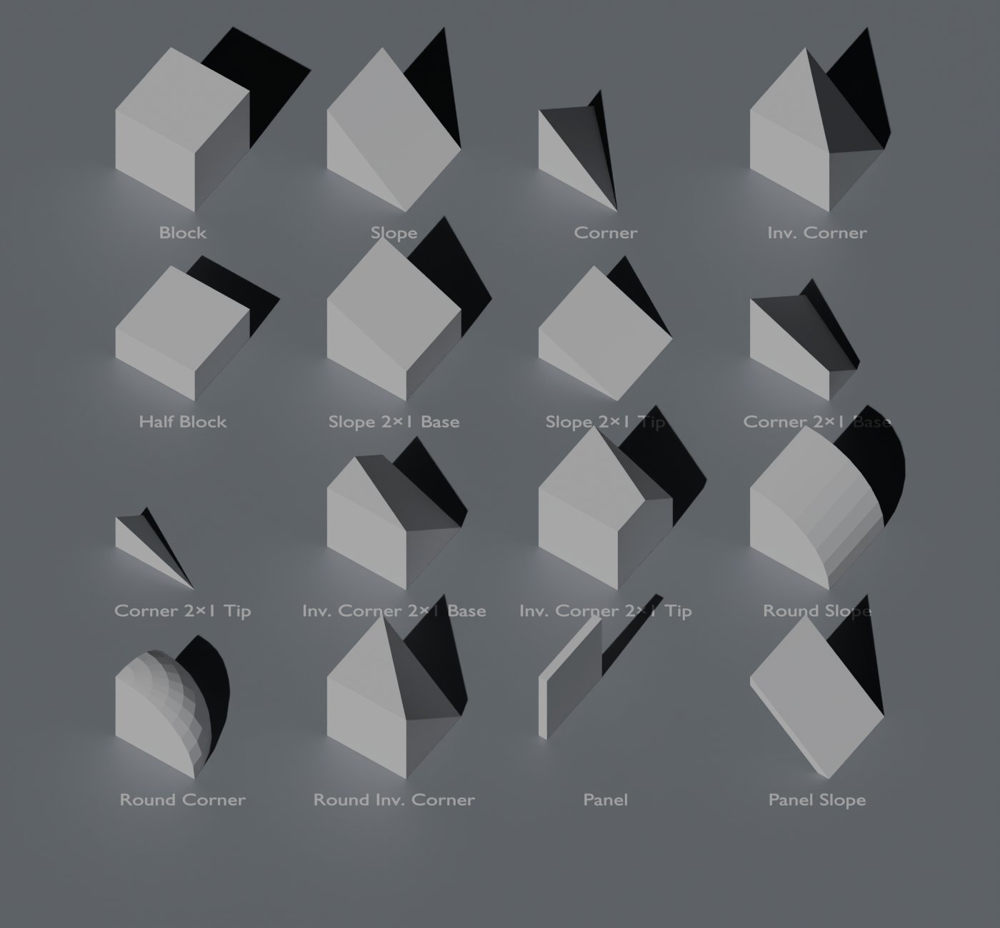

<!-- GENERATED by tools/parts/build.py from tools/parts/catalog/. Do not edit by hand. -->
# 02 — Structure & Armor

Hull, frame and interior-structure parts. Armor shapes are the most-placed parts in the game: they must tile perfectly, stay cheap, and read clearly in the Structural View.

**32 parts · 100 Blender assets.** Standards for every card are in [00 — Blender Modeling Standards](00-blender-modeling-standards.md).

*Blockouts generated by `tools/blender/exodus_parts.py` at exact grid size (large grid, 2.5 m cells).*

## Contents

| ID | Part | Group | Grids | Tier | Assets |
|---|---|---|---|---|---|
| STR-001 | [Armor Block](#str-001--armor-block) | Armor | LG · SG | T1 | 4 |
| STR-002 | [Armor Slope](#str-002--armor-slope) | Armor | LG · SG | T1 | 4 |
| STR-003 | [Armor Corner](#str-003--armor-corner) | Armor | LG · SG | T1 | 4 |
| STR-004 | [Armor Inverted Corner](#str-004--armor-inverted-corner) | Armor | LG · SG | T1 | 4 |
| STR-005 | [Armor Half Block](#str-005--armor-half-block) | Armor | LG · SG | T1 | 4 |
| STR-006 | [Armor Slope 2×1 Base](#str-006--armor-slope-21-base) | Armor | LG · SG | T1 | 4 |
| STR-007 | [Armor Slope 2×1 Tip](#str-007--armor-slope-21-tip) | Armor | LG · SG | T1 | 4 |
| STR-008 | [Armor Corner 2×1 Base](#str-008--armor-corner-21-base) | Armor | LG · SG | T1 | 4 |
| STR-009 | [Armor Corner 2×1 Tip](#str-009--armor-corner-21-tip) | Armor | LG · SG | T1 | 4 |
| STR-010 | [Armor Inverted Corner 2×1 Base](#str-010--armor-inverted-corner-21-base) | Armor | LG · SG | T1 | 4 |
| STR-011 | [Armor Inverted Corner 2×1 Tip](#str-011--armor-inverted-corner-21-tip) | Armor | LG · SG | T1 | 4 |
| STR-012 | [Armor Round Slope](#str-012--armor-round-slope) | Armor | LG · SG | T1 | 4 |
| STR-013 | [Armor Round Corner](#str-013--armor-round-corner) | Armor | LG · SG | T1 | 4 |
| STR-014 | [Armor Round Inverted Corner](#str-014--armor-round-inverted-corner) | Armor | LG · SG | T1 | 4 |
| STR-015 | [Armor Panel](#str-015--armor-panel) | Armor | LG · SG | T1 | 4 |
| STR-016 | [Armor Panel Slope](#str-016--armor-panel-slope) | Armor | LG · SG | T1 | 4 |
| STR-017 | [Scrap Wall](#str-017--scrap-wall) | Survivor Structure | LG | T0 | 4 |
| STR-018 | [Foundation Block](#str-018--foundation-block) | Base Structure | LG | T1 | 1 |
| STR-019 | [Structural Pillar](#str-019--structural-pillar) | Base Structure | LG | T1 | 1 |
| STR-020 | [I-Beam](#str-020--i-beam) | Frame | LG · SG | T1 | 6 |
| STR-021 | [Truss Frame](#str-021--truss-frame) | Frame | LG · SG | T1 | 2 |
| STR-022 | [Catwalk](#str-022--catwalk) | Walkways | LG | T1 | 4 |
| STR-023 | [Catwalk Railing](#str-023--catwalk-railing) | Walkways | LG | T1 | 3 |
| STR-024 | [Stairs](#str-024--stairs) | Walkways | LG | T1 | 1 |
| STR-025 | [Ramp](#str-025--ramp) | Walkways | LG | T1 | 1 |
| STR-026 | [Window 1×1](#str-026--window-11) | Windows | LG · SG | T1 | 2 |
| STR-027 | [Window 1×2](#str-027--window-12) | Windows | LG · SG | T1 | 2 |
| STR-028 | [Window Slope](#str-028--window-slope) | Windows | LG · SG | T1 | 2 |
| STR-029 | [Observation Dome](#str-029--observation-dome) | Windows | LG | T2 | 1 |
| STR-030 | [Interior Wall](#str-030--interior-wall) | Interior | LG | T1 | 4 |
| STR-031 | [Interior Pillar](#str-031--interior-pillar) | Interior | LG | T1 | 1 |
| STR-032 | [Ceiling Panel](#str-032--ceiling-panel) | Interior | LG | T1 | 1 |

---

### STR-001 · Armor Block

`block.structure.armor_block` · **Tier** T1 · **Art set** Kestrel Industrial · **Complexity** S (Simple) · **Group** Armor

> Structural hull piece (block shape). Light armor for structure; Heavy armor for combat hulls and Brute-proof base walls.

**Gameplay (base variant)**

| | Large grid | Small grid |
|---|---|---|
| Size (cells, W×H×D) | 1×1×1 | 1×1×1 |
| Dimensions (m, W×H×D) | 2.50 × 2.50 × 2.50 | 0.50 × 0.50 × 0.50 |
| Mass | 500 kg | 20 kg |
| Integrity (HP) | 1,500 | 60 |
| Power | — | — |
| Recipe | 25 Steel Plate | 1 Steel Plate |

**Unlock:** Light: T1 (Assembler). Heavy: T2.

**Blender assets**

| Asset | Variant | Grid | Dimensions (m) | Tier | Mass (kg) | HP | Tris LOD0 / 1 / 2 / 3 | Debris |
|---|---|---|---|---|---|---|---|---|
| `SM_STR_ArmorBlock_Light_LG` | Light | LG | 2.50 × 2.50 × 2.50 | T1 | 500 | 1,500 | 800 / 400 / 160 / 48 | S |
| `SM_STR_ArmorBlock_Light_SG` | Light | SG | 0.50 × 0.50 × 0.50 | T1 | 20 | 60 | 300 / 150 / 60 / 18 | XS |
| `SM_STR_ArmorBlock_Heavy_LG` | Heavy | LG | 2.50 × 2.50 × 2.50 | T2 | 3,300 | 6,495 | 800 / 400 / 160 / 48 | S |
| `SM_STR_ArmorBlock_Heavy_SG` | Heavy | SG | 0.50 × 0.50 × 0.50 | T2 | 132 | 260 | 300 / 150 / 60 / 18 | XS |

**Blender detail**

- **Pivot & axes:** origin at the bounding-volume center, grid-aligned. Front = +X, up = +Z, left = +Y. Apply all transforms (scale 1.0).
- **Mount faces:** all six faces · **Airtight faces:** all six faces
- **Construction stages:** 2 — BS1 Frame (0–49%), BS2 Plated (50–99%) (`<asset>_BS1…`), plus the final mesh
- **Collision:** ≤ 2 convex hulls named `UCX_<asset>_NN`
- **Materials:** `MI_IND_*` (Kestrel Industrial) · Shared trim sheet only (no unique maps) · texel density 512 px/m (LG) / 1,024 px/m (SG) · damage overlay + deformation mask
- **Sockets (empties):** none
- **Modeling notes:** The workhorse. Panel seams every 0.625 m (LG) / 0.125 m (SG) so neighbours read as one continuous hull. All six faces identical so rotation never shows. Deformation: vertex-shader dents driven by the damage texture; no separate damaged mesh.
- **Light variant:** Single-skin plates, 20 mm edge bevel (LG). Uses MI_IND_ArmorLight.
- **Heavy variant:** Double-skin look: 60 mm outer plates with bolt rows and recessed seams. Uses MI_IND_ArmorHeavy. Same silhouette as Light, so the two can be mixed on one hull.
- **Files:** `assets/parts/structure/<asset>.blend` → `export/parts/…/<asset>.fbx`

---

### STR-002 · Armor Slope

`block.structure.armor_slope` · **Tier** T1 · **Art set** Kestrel Industrial · **Complexity** S (Simple) · **Group** Armor

> Structural hull piece (slope shape). Light armor for structure; Heavy armor for combat hulls and Brute-proof base walls.

**Gameplay (base variant)**

| | Large grid | Small grid |
|---|---|---|
| Size (cells, W×H×D) | 1×1×1 | 1×1×1 |
| Dimensions (m, W×H×D) | 2.50 × 2.50 × 2.50 | 0.50 × 0.50 × 0.50 |
| Mass | 250 kg | 10 kg |
| Integrity (HP) | 750 | 30 |
| Power | — | — |
| Recipe | 12 Steel Plate | 1 Steel Plate |

**Unlock:** Light: T1 (Assembler). Heavy: T2.

**Blender assets**

| Asset | Variant | Grid | Dimensions (m) | Tier | Mass (kg) | HP | Tris LOD0 / 1 / 2 / 3 | Debris |
|---|---|---|---|---|---|---|---|---|
| `SM_STR_ArmorSlope_Light_LG` | Light | LG | 2.50 × 2.50 × 2.50 | T1 | 250 | 750 | 800 / 400 / 160 / 48 | S |
| `SM_STR_ArmorSlope_Light_SG` | Light | SG | 0.50 × 0.50 × 0.50 | T1 | 10 | 30 | 300 / 150 / 60 / 18 | XS |
| `SM_STR_ArmorSlope_Heavy_LG` | Heavy | LG | 2.50 × 2.50 × 2.50 | T2 | 1,650 | 3,248 | 800 / 400 / 160 / 48 | S |
| `SM_STR_ArmorSlope_Heavy_SG` | Heavy | SG | 0.50 × 0.50 × 0.50 | T2 | 66 | 130 | 300 / 150 / 60 / 18 | XS |

**Blender detail**

- **Pivot & axes:** origin at the bounding-volume center, grid-aligned. Front = +X, up = +Z, left = +Y. Apply all transforms (scale 1.0).
- **Mount faces:** back, bottom, left, right · **Airtight faces:** all six faces
- **Construction stages:** 2 — BS1 Frame (0–49%), BS2 Plated (50–99%) (`<asset>_BS1…`), plus the final mesh
- **Collision:** ≤ 2 convex hulls named `UCX_<asset>_NN`
- **Materials:** `MI_IND_*` (Kestrel Industrial) · Shared trim sheet only (no unique maps) · texel density 512 px/m (LG) / 1,024 px/m (SG) · damage overlay + deformation mask
- **Sockets (empties):** none
- **Modeling notes:** 45° face from front-bottom edge to back-top edge. Side faces are right triangles; keep seam lines matching the Block's. Deformation: vertex-shader dents driven by the damage texture; no separate damaged mesh.
- **Light variant:** Single-skin plates, 20 mm edge bevel (LG). Uses MI_IND_ArmorLight.
- **Heavy variant:** Double-skin look: 60 mm outer plates with bolt rows and recessed seams. Uses MI_IND_ArmorHeavy. Same silhouette as Light, so the two can be mixed on one hull.
- **Files:** `assets/parts/structure/<asset>.blend` → `export/parts/…/<asset>.fbx`

---

### STR-003 · Armor Corner

`block.structure.armor_corner` · **Tier** T1 · **Art set** Kestrel Industrial · **Complexity** S (Simple) · **Group** Armor

> Structural hull piece (corner shape). Light armor for structure; Heavy armor for combat hulls and Brute-proof base walls.

**Gameplay (base variant)**

| | Large grid | Small grid |
|---|---|---|
| Size (cells, W×H×D) | 1×1×1 | 1×1×1 |
| Dimensions (m, W×H×D) | 2.50 × 2.50 × 2.50 | 0.50 × 0.50 × 0.50 |
| Mass | 85 kg | 3 kg |
| Integrity (HP) | 255 | 10 |
| Power | — | — |
| Recipe | 4 Steel Plate | 1 Steel Plate |

**Unlock:** Light: T1 (Assembler). Heavy: T2.

**Blender assets**

| Asset | Variant | Grid | Dimensions (m) | Tier | Mass (kg) | HP | Tris LOD0 / 1 / 2 / 3 | Debris |
|---|---|---|---|---|---|---|---|---|
| `SM_STR_ArmorCorner_Light_LG` | Light | LG | 2.50 × 2.50 × 2.50 | T1 | 85 | 255 | 800 / 400 / 160 / 48 | S |
| `SM_STR_ArmorCorner_Light_SG` | Light | SG | 0.50 × 0.50 × 0.50 | T1 | 3 | 10 | 300 / 150 / 60 / 18 | XS |
| `SM_STR_ArmorCorner_Heavy_LG` | Heavy | LG | 2.50 × 2.50 × 2.50 | T2 | 561 | 1,104 | 800 / 400 / 160 / 48 | S |
| `SM_STR_ArmorCorner_Heavy_SG` | Heavy | SG | 0.50 × 0.50 × 0.50 | T2 | 20 | 43 | 300 / 150 / 60 / 18 | XS |

**Blender detail**

- **Pivot & axes:** origin at the bounding-volume center, grid-aligned. Front = +X, up = +Z, left = +Y. Apply all transforms (scale 1.0).
- **Mount faces:** back, bottom, right · **Airtight faces:** all six faces
- **Construction stages:** 2 — BS1 Frame (0–49%), BS2 Plated (50–99%) (`<asset>_BS1…`), plus the final mesh
- **Collision:** ≤ 2 convex hulls named `UCX_<asset>_NN`
- **Materials:** `MI_IND_*` (Kestrel Industrial) · Shared trim sheet only (no unique maps) · texel density 512 px/m (LG) / 1,024 px/m (SG) · damage overlay + deformation mask
- **Sockets (empties):** none
- **Modeling notes:** Tetrahedron filling one corner. Pairs with Slope; the three open edges need 2 mm bevel continuity. Deformation: vertex-shader dents driven by the damage texture; no separate damaged mesh.
- **Light variant:** Single-skin plates, 20 mm edge bevel (LG). Uses MI_IND_ArmorLight.
- **Heavy variant:** Double-skin look: 60 mm outer plates with bolt rows and recessed seams. Uses MI_IND_ArmorHeavy. Same silhouette as Light, so the two can be mixed on one hull.
- **Files:** `assets/parts/structure/<asset>.blend` → `export/parts/…/<asset>.fbx`

---

### STR-004 · Armor Inverted Corner

`block.structure.armor_inverted_corner` · **Tier** T1 · **Art set** Kestrel Industrial · **Complexity** S (Simple) · **Group** Armor

> Structural hull piece (inverted corner shape). Light armor for structure; Heavy armor for combat hulls and Brute-proof base walls.

**Gameplay (base variant)**

| | Large grid | Small grid |
|---|---|---|
| Size (cells, W×H×D) | 1×1×1 | 1×1×1 |
| Dimensions (m, W×H×D) | 2.50 × 2.50 × 2.50 | 0.50 × 0.50 × 0.50 |
| Mass | 415 kg | 17 kg |
| Integrity (HP) | 1,245 | 50 |
| Power | — | — |
| Recipe | 21 Steel Plate | 1 Steel Plate |

**Unlock:** Light: T1 (Assembler). Heavy: T2.

**Blender assets**

| Asset | Variant | Grid | Dimensions (m) | Tier | Mass (kg) | HP | Tris LOD0 / 1 / 2 / 3 | Debris |
|---|---|---|---|---|---|---|---|---|
| `SM_STR_ArmorInvertedCorner_Light_LG` | Light | LG | 2.50 × 2.50 × 2.50 | T1 | 415 | 1,245 | 800 / 400 / 160 / 48 | S |
| `SM_STR_ArmorInvertedCorner_Light_SG` | Light | SG | 0.50 × 0.50 × 0.50 | T1 | 17 | 50 | 300 / 150 / 60 / 18 | XS |
| `SM_STR_ArmorInvertedCorner_Heavy_LG` | Heavy | LG | 2.50 × 2.50 × 2.50 | T2 | 2,739 | 5,391 | 800 / 400 / 160 / 48 | S |
| `SM_STR_ArmorInvertedCorner_Heavy_SG` | Heavy | SG | 0.50 × 0.50 × 0.50 | T2 | 112 | 216 | 300 / 150 / 60 / 18 | XS |

**Blender detail**

- **Pivot & axes:** origin at the bounding-volume center, grid-aligned. Front = +X, up = +Z, left = +Y. Apply all transforms (scale 1.0).
- **Mount faces:** all six faces · **Airtight faces:** all six faces
- **Construction stages:** 2 — BS1 Frame (0–49%), BS2 Plated (50–99%) (`<asset>_BS1…`), plus the final mesh
- **Collision:** ≤ 2 convex hulls named `UCX_<asset>_NN`
- **Materials:** `MI_IND_*` (Kestrel Industrial) · Shared trim sheet only (no unique maps) · texel density 512 px/m (LG) / 1,024 px/m (SG) · damage overlay + deformation mask
- **Sockets (empties):** none
- **Modeling notes:** Cube with one corner cut by a plane through three adjacent vertices. Used to close Slope junctions. Deformation: vertex-shader dents driven by the damage texture; no separate damaged mesh.
- **Light variant:** Single-skin plates, 20 mm edge bevel (LG). Uses MI_IND_ArmorLight.
- **Heavy variant:** Double-skin look: 60 mm outer plates with bolt rows and recessed seams. Uses MI_IND_ArmorHeavy. Same silhouette as Light, so the two can be mixed on one hull.
- **Files:** `assets/parts/structure/<asset>.blend` → `export/parts/…/<asset>.fbx`

---

### STR-005 · Armor Half Block

`block.structure.armor_half_block` · **Tier** T1 · **Art set** Kestrel Industrial · **Complexity** S (Simple) · **Group** Armor

> Structural hull piece (half block shape). Light armor for structure; Heavy armor for combat hulls and Brute-proof base walls.

**Gameplay (base variant)**

| | Large grid | Small grid |
|---|---|---|
| Size (cells, W×H×D) | 1×1×1 | 1×1×1 |
| Dimensions (m, W×H×D) | 2.50 × 2.50 × 2.50 | 0.50 × 0.50 × 0.50 |
| Mass | 250 kg | 10 kg |
| Integrity (HP) | 750 | 30 |
| Power | — | — |
| Recipe | 12 Steel Plate | 1 Steel Plate |

**Unlock:** Light: T1 (Assembler). Heavy: T2.

**Blender assets**

| Asset | Variant | Grid | Dimensions (m) | Tier | Mass (kg) | HP | Tris LOD0 / 1 / 2 / 3 | Debris |
|---|---|---|---|---|---|---|---|---|
| `SM_STR_ArmorHalfBlock_Light_LG` | Light | LG | 2.50 × 2.50 × 2.50 | T1 | 250 | 750 | 800 / 400 / 160 / 48 | S |
| `SM_STR_ArmorHalfBlock_Light_SG` | Light | SG | 0.50 × 0.50 × 0.50 | T1 | 10 | 30 | 300 / 150 / 60 / 18 | XS |
| `SM_STR_ArmorHalfBlock_Heavy_LG` | Heavy | LG | 2.50 × 2.50 × 2.50 | T2 | 1,650 | 3,248 | 800 / 400 / 160 / 48 | S |
| `SM_STR_ArmorHalfBlock_Heavy_SG` | Heavy | SG | 0.50 × 0.50 × 0.50 | T2 | 66 | 130 | 300 / 150 / 60 / 18 | XS |

**Blender detail**

- **Pivot & axes:** origin at the bounding-volume center, grid-aligned. Front = +X, up = +Z, left = +Y. Apply all transforms (scale 1.0).
- **Mount faces:** all six faces · **Airtight faces:** all six faces
- **Construction stages:** 2 — BS1 Frame (0–49%), BS2 Plated (50–99%) (`<asset>_BS1…`), plus the final mesh
- **Collision:** ≤ 2 convex hulls named `UCX_<asset>_NN`
- **Materials:** `MI_IND_*` (Kestrel Industrial) · Shared trim sheet only (no unique maps) · texel density 512 px/m (LG) / 1,024 px/m (SG) · damage overlay + deformation mask
- **Sockets (empties):** none
- **Modeling notes:** Bottom half of the cell (0–50% height). Top face gets the full-panel trim, not a cut edge. Deformation: vertex-shader dents driven by the damage texture; no separate damaged mesh.
- **Light variant:** Single-skin plates, 20 mm edge bevel (LG). Uses MI_IND_ArmorLight.
- **Heavy variant:** Double-skin look: 60 mm outer plates with bolt rows and recessed seams. Uses MI_IND_ArmorHeavy. Same silhouette as Light, so the two can be mixed on one hull.
- **Files:** `assets/parts/structure/<asset>.blend` → `export/parts/…/<asset>.fbx`

---

### STR-006 · Armor Slope 2×1 Base

`block.structure.armor_slope_2x1_base` · **Tier** T1 · **Art set** Kestrel Industrial · **Complexity** S (Simple) · **Group** Armor

> Structural hull piece (slope 2×1 base shape). Light armor for structure; Heavy armor for combat hulls and Brute-proof base walls.

**Gameplay (base variant)**

| | Large grid | Small grid |
|---|---|---|
| Size (cells, W×H×D) | 1×1×1 | 1×1×1 |
| Dimensions (m, W×H×D) | 2.50 × 2.50 × 2.50 | 0.50 × 0.50 × 0.50 |
| Mass | 375 kg | 15 kg |
| Integrity (HP) | 1,125 | 45 |
| Power | — | — |
| Recipe | 19 Steel Plate | 1 Steel Plate |

**Unlock:** Light: T1 (Assembler). Heavy: T2.

**Blender assets**

| Asset | Variant | Grid | Dimensions (m) | Tier | Mass (kg) | HP | Tris LOD0 / 1 / 2 / 3 | Debris |
|---|---|---|---|---|---|---|---|---|
| `SM_STR_ArmorSlope2x1Base_Light_LG` | Light | LG | 2.50 × 2.50 × 2.50 | T1 | 375 | 1,125 | 800 / 400 / 160 / 48 | S |
| `SM_STR_ArmorSlope2x1Base_Light_SG` | Light | SG | 0.50 × 0.50 × 0.50 | T1 | 15 | 45 | 300 / 150 / 60 / 18 | XS |
| `SM_STR_ArmorSlope2x1Base_Heavy_LG` | Heavy | LG | 2.50 × 2.50 × 2.50 | T2 | 2,475 | 4,871 | 800 / 400 / 160 / 48 | S |
| `SM_STR_ArmorSlope2x1Base_Heavy_SG` | Heavy | SG | 0.50 × 0.50 × 0.50 | T2 | 99 | 195 | 300 / 150 / 60 / 18 | XS |

**Blender detail**

- **Pivot & axes:** origin at the bounding-volume center, grid-aligned. Front = +X, up = +Z, left = +Y. Apply all transforms (scale 1.0).
- **Mount faces:** back, bottom, left, right · **Airtight faces:** all six faces
- **Construction stages:** 2 — BS1 Frame (0–49%), BS2 Plated (50–99%) (`<asset>_BS1…`), plus the final mesh
- **Collision:** ≤ 2 convex hulls named `UCX_<asset>_NN`
- **Materials:** `MI_IND_*` (Kestrel Industrial) · Shared trim sheet only (no unique maps) · texel density 512 px/m (LG) / 1,024 px/m (SG) · damage overlay + deformation mask
- **Sockets (empties):** none
- **Modeling notes:** Lower half of a 2-cell-long 26.6° slope (rises 0.5 cell over 1). Front edge sits at 50% height to meet the Tip. Deformation: vertex-shader dents driven by the damage texture; no separate damaged mesh.
- **Light variant:** Single-skin plates, 20 mm edge bevel (LG). Uses MI_IND_ArmorLight.
- **Heavy variant:** Double-skin look: 60 mm outer plates with bolt rows and recessed seams. Uses MI_IND_ArmorHeavy. Same silhouette as Light, so the two can be mixed on one hull.
- **Files:** `assets/parts/structure/<asset>.blend` → `export/parts/…/<asset>.fbx`

---

### STR-007 · Armor Slope 2×1 Tip

`block.structure.armor_slope_2x1_tip` · **Tier** T1 · **Art set** Kestrel Industrial · **Complexity** S (Simple) · **Group** Armor

> Structural hull piece (slope 2×1 tip shape). Light armor for structure; Heavy armor for combat hulls and Brute-proof base walls.

**Gameplay (base variant)**

| | Large grid | Small grid |
|---|---|---|
| Size (cells, W×H×D) | 1×1×1 | 1×1×1 |
| Dimensions (m, W×H×D) | 2.50 × 2.50 × 2.50 | 0.50 × 0.50 × 0.50 |
| Mass | 125 kg | 5 kg |
| Integrity (HP) | 375 | 15 |
| Power | — | — |
| Recipe | 6 Steel Plate | 1 Steel Plate |

**Unlock:** Light: T1 (Assembler). Heavy: T2.

**Blender assets**

| Asset | Variant | Grid | Dimensions (m) | Tier | Mass (kg) | HP | Tris LOD0 / 1 / 2 / 3 | Debris |
|---|---|---|---|---|---|---|---|---|
| `SM_STR_ArmorSlope2x1Tip_Light_LG` | Light | LG | 2.50 × 2.50 × 2.50 | T1 | 125 | 375 | 800 / 400 / 160 / 48 | S |
| `SM_STR_ArmorSlope2x1Tip_Light_SG` | Light | SG | 0.50 × 0.50 × 0.50 | T1 | 5 | 15 | 300 / 150 / 60 / 18 | XS |
| `SM_STR_ArmorSlope2x1Tip_Heavy_LG` | Heavy | LG | 2.50 × 2.50 × 2.50 | T2 | 825 | 1,624 | 800 / 400 / 160 / 48 | S |
| `SM_STR_ArmorSlope2x1Tip_Heavy_SG` | Heavy | SG | 0.50 × 0.50 × 0.50 | T2 | 33 | 65 | 300 / 150 / 60 / 18 | XS |

**Blender detail**

- **Pivot & axes:** origin at the bounding-volume center, grid-aligned. Front = +X, up = +Z, left = +Y. Apply all transforms (scale 1.0).
- **Mount faces:** back, bottom, left, right · **Airtight faces:** all six faces
- **Construction stages:** 2 — BS1 Frame (0–49%), BS2 Plated (50–99%) (`<asset>_BS1…`), plus the final mesh
- **Collision:** ≤ 2 convex hulls named `UCX_<asset>_NN`
- **Materials:** `MI_IND_*` (Kestrel Industrial) · Shared trim sheet only (no unique maps) · texel density 512 px/m (LG) / 1,024 px/m (SG) · damage overlay + deformation mask
- **Sockets (empties):** none
- **Modeling notes:** Upper half of the 2×1 slope; rises from 0 to 50% height. Must meet the Base with zero gap. Deformation: vertex-shader dents driven by the damage texture; no separate damaged mesh.
- **Light variant:** Single-skin plates, 20 mm edge bevel (LG). Uses MI_IND_ArmorLight.
- **Heavy variant:** Double-skin look: 60 mm outer plates with bolt rows and recessed seams. Uses MI_IND_ArmorHeavy. Same silhouette as Light, so the two can be mixed on one hull.
- **Files:** `assets/parts/structure/<asset>.blend` → `export/parts/…/<asset>.fbx`

---

### STR-008 · Armor Corner 2×1 Base

`block.structure.armor_corner_2x1_base` · **Tier** T1 · **Art set** Kestrel Industrial · **Complexity** S (Simple) · **Group** Armor

> Structural hull piece (corner 2×1 base shape). Light armor for structure; Heavy armor for combat hulls and Brute-proof base walls.

**Gameplay (base variant)**

| | Large grid | Small grid |
|---|---|---|
| Size (cells, W×H×D) | 1×1×1 | 1×1×1 |
| Dimensions (m, W×H×D) | 2.50 × 2.50 × 2.50 | 0.50 × 0.50 × 0.50 |
| Mass | 165 kg | 7 kg |
| Integrity (HP) | 495 | 20 |
| Power | — | — |
| Recipe | 8 Steel Plate | 1 Steel Plate |

**Unlock:** Light: T1 (Assembler). Heavy: T2.

**Blender assets**

| Asset | Variant | Grid | Dimensions (m) | Tier | Mass (kg) | HP | Tris LOD0 / 1 / 2 / 3 | Debris |
|---|---|---|---|---|---|---|---|---|
| `SM_STR_ArmorCorner2x1Base_Light_LG` | Light | LG | 2.50 × 2.50 × 2.50 | T1 | 165 | 495 | 800 / 400 / 160 / 48 | S |
| `SM_STR_ArmorCorner2x1Base_Light_SG` | Light | SG | 0.50 × 0.50 × 0.50 | T1 | 7 | 20 | 300 / 150 / 60 / 18 | XS |
| `SM_STR_ArmorCorner2x1Base_Heavy_LG` | Heavy | LG | 2.50 × 2.50 × 2.50 | T2 | 1,089 | 2,143 | 800 / 400 / 160 / 48 | S |
| `SM_STR_ArmorCorner2x1Base_Heavy_SG` | Heavy | SG | 0.50 × 0.50 × 0.50 | T2 | 46 | 87 | 300 / 150 / 60 / 18 | XS |

**Blender detail**

- **Pivot & axes:** origin at the bounding-volume center, grid-aligned. Front = +X, up = +Z, left = +Y. Apply all transforms (scale 1.0).
- **Mount faces:** back, bottom, right · **Airtight faces:** all six faces
- **Construction stages:** 2 — BS1 Frame (0–49%), BS2 Plated (50–99%) (`<asset>_BS1…`), plus the final mesh
- **Collision:** ≤ 2 convex hulls named `UCX_<asset>_NN`
- **Materials:** `MI_IND_*` (Kestrel Industrial) · Shared trim sheet only (no unique maps) · texel density 512 px/m (LG) / 1,024 px/m (SG) · damage overlay + deformation mask
- **Sockets (empties):** none
- **Modeling notes:** Corner piece for 2×1 slopes (base half). Deformation: vertex-shader dents driven by the damage texture; no separate damaged mesh.
- **Light variant:** Single-skin plates, 20 mm edge bevel (LG). Uses MI_IND_ArmorLight.
- **Heavy variant:** Double-skin look: 60 mm outer plates with bolt rows and recessed seams. Uses MI_IND_ArmorHeavy. Same silhouette as Light, so the two can be mixed on one hull.
- **Files:** `assets/parts/structure/<asset>.blend` → `export/parts/…/<asset>.fbx`

---

### STR-009 · Armor Corner 2×1 Tip

`block.structure.armor_corner_2x1_tip` · **Tier** T1 · **Art set** Kestrel Industrial · **Complexity** S (Simple) · **Group** Armor

> Structural hull piece (corner 2×1 tip shape). Light armor for structure; Heavy armor for combat hulls and Brute-proof base walls.

**Gameplay (base variant)**

| | Large grid | Small grid |
|---|---|---|
| Size (cells, W×H×D) | 1×1×1 | 1×1×1 |
| Dimensions (m, W×H×D) | 2.50 × 2.50 × 2.50 | 0.50 × 0.50 × 0.50 |
| Mass | 40 kg | 2 kg |
| Integrity (HP) | 120 | 5 |
| Power | — | — |
| Recipe | 2 Steel Plate | 1 Steel Plate |

**Unlock:** Light: T1 (Assembler). Heavy: T2.

**Blender assets**

| Asset | Variant | Grid | Dimensions (m) | Tier | Mass (kg) | HP | Tris LOD0 / 1 / 2 / 3 | Debris |
|---|---|---|---|---|---|---|---|---|
| `SM_STR_ArmorCorner2x1Tip_Light_LG` | Light | LG | 2.50 × 2.50 × 2.50 | T1 | 40 | 120 | 800 / 400 / 160 / 48 | S |
| `SM_STR_ArmorCorner2x1Tip_Light_SG` | Light | SG | 0.50 × 0.50 × 0.50 | T1 | 2 | 5 | 300 / 150 / 60 / 18 | XS |
| `SM_STR_ArmorCorner2x1Tip_Heavy_LG` | Heavy | LG | 2.50 × 2.50 × 2.50 | T2 | 264 | 520 | 800 / 400 / 160 / 48 | S |
| `SM_STR_ArmorCorner2x1Tip_Heavy_SG` | Heavy | SG | 0.50 × 0.50 × 0.50 | T2 | 13 | 22 | 300 / 150 / 60 / 18 | XS |

**Blender detail**

- **Pivot & axes:** origin at the bounding-volume center, grid-aligned. Front = +X, up = +Z, left = +Y. Apply all transforms (scale 1.0).
- **Mount faces:** back, bottom, right · **Airtight faces:** all six faces
- **Construction stages:** 2 — BS1 Frame (0–49%), BS2 Plated (50–99%) (`<asset>_BS1…`), plus the final mesh
- **Collision:** ≤ 2 convex hulls named `UCX_<asset>_NN`
- **Materials:** `MI_IND_*` (Kestrel Industrial) · Shared trim sheet only (no unique maps) · texel density 512 px/m (LG) / 1,024 px/m (SG) · damage overlay + deformation mask
- **Sockets (empties):** none
- **Modeling notes:** Corner piece for 2×1 slopes (tip half). Tiny: keep it under 60% of the Simple budget. Deformation: vertex-shader dents driven by the damage texture; no separate damaged mesh.
- **Light variant:** Single-skin plates, 20 mm edge bevel (LG). Uses MI_IND_ArmorLight.
- **Heavy variant:** Double-skin look: 60 mm outer plates with bolt rows and recessed seams. Uses MI_IND_ArmorHeavy. Same silhouette as Light, so the two can be mixed on one hull.
- **Files:** `assets/parts/structure/<asset>.blend` → `export/parts/…/<asset>.fbx`

---

### STR-010 · Armor Inverted Corner 2×1 Base

`block.structure.armor_inverted_corner_2x1_base` · **Tier** T1 · **Art set** Kestrel Industrial · **Complexity** S (Simple) · **Group** Armor

> Structural hull piece (inverted corner 2×1 base shape). Light armor for structure; Heavy armor for combat hulls and Brute-proof base walls.

**Gameplay (base variant)**

| | Large grid | Small grid |
|---|---|---|
| Size (cells, W×H×D) | 1×1×1 | 1×1×1 |
| Dimensions (m, W×H×D) | 2.50 × 2.50 × 2.50 | 0.50 × 0.50 × 0.50 |
| Mass | 460 kg | 18 kg |
| Integrity (HP) | 1,380 | 55 |
| Power | — | — |
| Recipe | 23 Steel Plate | 1 Steel Plate |

**Unlock:** Light: T1 (Assembler). Heavy: T2.

**Blender assets**

| Asset | Variant | Grid | Dimensions (m) | Tier | Mass (kg) | HP | Tris LOD0 / 1 / 2 / 3 | Debris |
|---|---|---|---|---|---|---|---|---|
| `SM_STR_ArmorInvertedCorner2x1Base_Light_LG` | Light | LG | 2.50 × 2.50 × 2.50 | T1 | 460 | 1,380 | 800 / 400 / 160 / 48 | S |
| `SM_STR_ArmorInvertedCorner2x1Base_Light_SG` | Light | SG | 0.50 × 0.50 × 0.50 | T1 | 18 | 55 | 300 / 150 / 60 / 18 | XS |
| `SM_STR_ArmorInvertedCorner2x1Base_Heavy_LG` | Heavy | LG | 2.50 × 2.50 × 2.50 | T2 | 3,036 | 5,975 | 800 / 400 / 160 / 48 | S |
| `SM_STR_ArmorInvertedCorner2x1Base_Heavy_SG` | Heavy | SG | 0.50 × 0.50 × 0.50 | T2 | 119 | 238 | 300 / 150 / 60 / 18 | XS |

**Blender detail**

- **Pivot & axes:** origin at the bounding-volume center, grid-aligned. Front = +X, up = +Z, left = +Y. Apply all transforms (scale 1.0).
- **Mount faces:** all six faces · **Airtight faces:** all six faces
- **Construction stages:** 2 — BS1 Frame (0–49%), BS2 Plated (50–99%) (`<asset>_BS1…`), plus the final mesh
- **Collision:** ≤ 2 convex hulls named `UCX_<asset>_NN`
- **Materials:** `MI_IND_*` (Kestrel Industrial) · Shared trim sheet only (no unique maps) · texel density 512 px/m (LG) / 1,024 px/m (SG) · damage overlay + deformation mask
- **Sockets (empties):** none
- **Modeling notes:** Inverted corner matching the 2×1 slope angle (base half). Deformation: vertex-shader dents driven by the damage texture; no separate damaged mesh.
- **Light variant:** Single-skin plates, 20 mm edge bevel (LG). Uses MI_IND_ArmorLight.
- **Heavy variant:** Double-skin look: 60 mm outer plates with bolt rows and recessed seams. Uses MI_IND_ArmorHeavy. Same silhouette as Light, so the two can be mixed on one hull.
- **Files:** `assets/parts/structure/<asset>.blend` → `export/parts/…/<asset>.fbx`

---

### STR-011 · Armor Inverted Corner 2×1 Tip

`block.structure.armor_inverted_corner_2x1_tip` · **Tier** T1 · **Art set** Kestrel Industrial · **Complexity** S (Simple) · **Group** Armor

> Structural hull piece (inverted corner 2×1 tip shape). Light armor for structure; Heavy armor for combat hulls and Brute-proof base walls.

**Gameplay (base variant)**

| | Large grid | Small grid |
|---|---|---|
| Size (cells, W×H×D) | 1×1×1 | 1×1×1 |
| Dimensions (m, W×H×D) | 2.50 × 2.50 × 2.50 | 0.50 × 0.50 × 0.50 |
| Mass | 290 kg | 12 kg |
| Integrity (HP) | 870 | 35 |
| Power | — | — |
| Recipe | 14 Steel Plate | 1 Steel Plate |

**Unlock:** Light: T1 (Assembler). Heavy: T2.

**Blender assets**

| Asset | Variant | Grid | Dimensions (m) | Tier | Mass (kg) | HP | Tris LOD0 / 1 / 2 / 3 | Debris |
|---|---|---|---|---|---|---|---|---|
| `SM_STR_ArmorInvertedCorner2x1Tip_Light_LG` | Light | LG | 2.50 × 2.50 × 2.50 | T1 | 290 | 870 | 800 / 400 / 160 / 48 | S |
| `SM_STR_ArmorInvertedCorner2x1Tip_Light_SG` | Light | SG | 0.50 × 0.50 × 0.50 | T1 | 12 | 35 | 300 / 150 / 60 / 18 | XS |
| `SM_STR_ArmorInvertedCorner2x1Tip_Heavy_LG` | Heavy | LG | 2.50 × 2.50 × 2.50 | T2 | 1,914 | 3,767 | 800 / 400 / 160 / 48 | S |
| `SM_STR_ArmorInvertedCorner2x1Tip_Heavy_SG` | Heavy | SG | 0.50 × 0.50 × 0.50 | T2 | 79 | 152 | 300 / 150 / 60 / 18 | XS |

**Blender detail**

- **Pivot & axes:** origin at the bounding-volume center, grid-aligned. Front = +X, up = +Z, left = +Y. Apply all transforms (scale 1.0).
- **Mount faces:** back, bottom, left, right · **Airtight faces:** all six faces
- **Construction stages:** 2 — BS1 Frame (0–49%), BS2 Plated (50–99%) (`<asset>_BS1…`), plus the final mesh
- **Collision:** ≤ 2 convex hulls named `UCX_<asset>_NN`
- **Materials:** `MI_IND_*` (Kestrel Industrial) · Shared trim sheet only (no unique maps) · texel density 512 px/m (LG) / 1,024 px/m (SG) · damage overlay + deformation mask
- **Sockets (empties):** none
- **Modeling notes:** Inverted corner matching the 2×1 slope angle (tip half). Deformation: vertex-shader dents driven by the damage texture; no separate damaged mesh.
- **Light variant:** Single-skin plates, 20 mm edge bevel (LG). Uses MI_IND_ArmorLight.
- **Heavy variant:** Double-skin look: 60 mm outer plates with bolt rows and recessed seams. Uses MI_IND_ArmorHeavy. Same silhouette as Light, so the two can be mixed on one hull.
- **Files:** `assets/parts/structure/<asset>.blend` → `export/parts/…/<asset>.fbx`

---

### STR-012 · Armor Round Slope

`block.structure.armor_round_slope` · **Tier** T1 · **Art set** Kestrel Industrial · **Complexity** S (Simple) · **Group** Armor

> Structural hull piece (round slope shape). Light armor for structure; Heavy armor for combat hulls and Brute-proof base walls.

**Gameplay (base variant)**

| | Large grid | Small grid |
|---|---|---|
| Size (cells, W×H×D) | 1×1×1 | 1×1×1 |
| Dimensions (m, W×H×D) | 2.50 × 2.50 × 2.50 | 0.50 × 0.50 × 0.50 |
| Mass | 300 kg | 12 kg |
| Integrity (HP) | 900 | 36 |
| Power | — | — |
| Recipe | 15 Steel Plate | 1 Steel Plate |

**Unlock:** Light: T1 (Assembler). Heavy: T2.

**Blender assets**

| Asset | Variant | Grid | Dimensions (m) | Tier | Mass (kg) | HP | Tris LOD0 / 1 / 2 / 3 | Debris |
|---|---|---|---|---|---|---|---|---|
| `SM_STR_ArmorRoundSlope_Light_LG` | Light | LG | 2.50 × 2.50 × 2.50 | T1 | 300 | 900 | 800 / 400 / 160 / 48 | S |
| `SM_STR_ArmorRoundSlope_Light_SG` | Light | SG | 0.50 × 0.50 × 0.50 | T1 | 12 | 36 | 300 / 150 / 60 / 18 | XS |
| `SM_STR_ArmorRoundSlope_Heavy_LG` | Heavy | LG | 2.50 × 2.50 × 2.50 | T2 | 1,980 | 3,897 | 800 / 400 / 160 / 48 | S |
| `SM_STR_ArmorRoundSlope_Heavy_SG` | Heavy | SG | 0.50 × 0.50 × 0.50 | T2 | 79 | 156 | 300 / 150 / 60 / 18 | XS |

**Blender detail**

- **Pivot & axes:** origin at the bounding-volume center, grid-aligned. Front = +X, up = +Z, left = +Y. Apply all transforms (scale 1.0).
- **Mount faces:** back, bottom, left, right · **Airtight faces:** all six faces
- **Construction stages:** 2 — BS1 Frame (0–49%), BS2 Plated (50–99%) (`<asset>_BS1…`), plus the final mesh
- **Collision:** ≤ 2 convex hulls named `UCX_<asset>_NN`
- **Materials:** `MI_IND_*` (Kestrel Industrial) · Shared trim sheet only (no unique maps) · texel density 512 px/m (LG) / 1,024 px/m (SG) · damage overlay + deformation mask
- **Sockets (empties):** none
- **Modeling notes:** Quarter-cylinder profile, 8 segments at LOD0 (4 at LOD2). Normals must match Round Corner exactly. Deformation: vertex-shader dents driven by the damage texture; no separate damaged mesh.
- **Light variant:** Single-skin plates, 20 mm edge bevel (LG). Uses MI_IND_ArmorLight.
- **Heavy variant:** Double-skin look: 60 mm outer plates with bolt rows and recessed seams. Uses MI_IND_ArmorHeavy. Same silhouette as Light, so the two can be mixed on one hull.
- **Files:** `assets/parts/structure/<asset>.blend` → `export/parts/…/<asset>.fbx`

---

### STR-013 · Armor Round Corner

`block.structure.armor_round_corner` · **Tier** T1 · **Art set** Kestrel Industrial · **Complexity** S (Simple) · **Group** Armor

> Structural hull piece (round corner shape). Light armor for structure; Heavy armor for combat hulls and Brute-proof base walls.

**Gameplay (base variant)**

| | Large grid | Small grid |
|---|---|---|
| Size (cells, W×H×D) | 1×1×1 | 1×1×1 |
| Dimensions (m, W×H×D) | 2.50 × 2.50 × 2.50 | 0.50 × 0.50 × 0.50 |
| Mass | 150 kg | 6 kg |
| Integrity (HP) | 450 | 18 |
| Power | — | — |
| Recipe | 8 Steel Plate | 1 Steel Plate |

**Unlock:** Light: T1 (Assembler). Heavy: T2.

**Blender assets**

| Asset | Variant | Grid | Dimensions (m) | Tier | Mass (kg) | HP | Tris LOD0 / 1 / 2 / 3 | Debris |
|---|---|---|---|---|---|---|---|---|
| `SM_STR_ArmorRoundCorner_Light_LG` | Light | LG | 2.50 × 2.50 × 2.50 | T1 | 150 | 450 | 800 / 400 / 160 / 48 | S |
| `SM_STR_ArmorRoundCorner_Light_SG` | Light | SG | 0.50 × 0.50 × 0.50 | T1 | 6 | 18 | 300 / 150 / 60 / 18 | XS |
| `SM_STR_ArmorRoundCorner_Heavy_LG` | Heavy | LG | 2.50 × 2.50 × 2.50 | T2 | 990 | 1,948 | 800 / 400 / 160 / 48 | S |
| `SM_STR_ArmorRoundCorner_Heavy_SG` | Heavy | SG | 0.50 × 0.50 × 0.50 | T2 | 40 | 78 | 300 / 150 / 60 / 18 | XS |

**Blender detail**

- **Pivot & axes:** origin at the bounding-volume center, grid-aligned. Front = +X, up = +Z, left = +Y. Apply all transforms (scale 1.0).
- **Mount faces:** back, bottom, right · **Airtight faces:** all six faces
- **Construction stages:** 2 — BS1 Frame (0–49%), BS2 Plated (50–99%) (`<asset>_BS1…`), plus the final mesh
- **Collision:** ≤ 2 convex hulls named `UCX_<asset>_NN`
- **Materials:** `MI_IND_*` (Kestrel Industrial) · Shared trim sheet only (no unique maps) · texel density 512 px/m (LG) / 1,024 px/m (SG) · damage overlay + deformation mask
- **Sockets (empties):** none
- **Modeling notes:** Eighth-sphere-style corner for Round Slopes. 8×8 segments LOD0. Deformation: vertex-shader dents driven by the damage texture; no separate damaged mesh.
- **Light variant:** Single-skin plates, 20 mm edge bevel (LG). Uses MI_IND_ArmorLight.
- **Heavy variant:** Double-skin look: 60 mm outer plates with bolt rows and recessed seams. Uses MI_IND_ArmorHeavy. Same silhouette as Light, so the two can be mixed on one hull.
- **Files:** `assets/parts/structure/<asset>.blend` → `export/parts/…/<asset>.fbx`

---

### STR-014 · Armor Round Inverted Corner

`block.structure.armor_round_inverted_corner` · **Tier** T1 · **Art set** Kestrel Industrial · **Complexity** S (Simple) · **Group** Armor

> Structural hull piece (round inverted corner shape). Light armor for structure; Heavy armor for combat hulls and Brute-proof base walls.

**Gameplay (base variant)**

| | Large grid | Small grid |
|---|---|---|
| Size (cells, W×H×D) | 1×1×1 | 1×1×1 |
| Dimensions (m, W×H×D) | 2.50 × 2.50 × 2.50 | 0.50 × 0.50 × 0.50 |
| Mass | 425 kg | 17 kg |
| Integrity (HP) | 1,275 | 51 |
| Power | — | — |
| Recipe | 21 Steel Plate | 1 Steel Plate |

**Unlock:** Light: T1 (Assembler). Heavy: T2.

**Blender assets**

| Asset | Variant | Grid | Dimensions (m) | Tier | Mass (kg) | HP | Tris LOD0 / 1 / 2 / 3 | Debris |
|---|---|---|---|---|---|---|---|---|
| `SM_STR_ArmorRoundInvertedCorner_Light_LG` | Light | LG | 2.50 × 2.50 × 2.50 | T1 | 425 | 1,275 | 800 / 400 / 160 / 48 | S |
| `SM_STR_ArmorRoundInvertedCorner_Light_SG` | Light | SG | 0.50 × 0.50 × 0.50 | T1 | 17 | 51 | 300 / 150 / 60 / 18 | XS |
| `SM_STR_ArmorRoundInvertedCorner_Heavy_LG` | Heavy | LG | 2.50 × 2.50 × 2.50 | T2 | 2,805 | 5,521 | 800 / 400 / 160 / 48 | S |
| `SM_STR_ArmorRoundInvertedCorner_Heavy_SG` | Heavy | SG | 0.50 × 0.50 × 0.50 | T2 | 112 | 221 | 300 / 150 / 60 / 18 | XS |

**Blender detail**

- **Pivot & axes:** origin at the bounding-volume center, grid-aligned. Front = +X, up = +Z, left = +Y. Apply all transforms (scale 1.0).
- **Mount faces:** all six faces · **Airtight faces:** all six faces
- **Construction stages:** 2 — BS1 Frame (0–49%), BS2 Plated (50–99%) (`<asset>_BS1…`), plus the final mesh
- **Collision:** ≤ 2 convex hulls named `UCX_<asset>_NN`
- **Materials:** `MI_IND_*` (Kestrel Industrial) · Shared trim sheet only (no unique maps) · texel density 512 px/m (LG) / 1,024 px/m (SG) · damage overlay + deformation mask
- **Sockets (empties):** none
- **Modeling notes:** Concave rounded corner. Custom split normals so it shades seamlessly against Round Slopes. Deformation: vertex-shader dents driven by the damage texture; no separate damaged mesh.
- **Light variant:** Single-skin plates, 20 mm edge bevel (LG). Uses MI_IND_ArmorLight.
- **Heavy variant:** Double-skin look: 60 mm outer plates with bolt rows and recessed seams. Uses MI_IND_ArmorHeavy. Same silhouette as Light, so the two can be mixed on one hull.
- **Files:** `assets/parts/structure/<asset>.blend` → `export/parts/…/<asset>.fbx`

---

### STR-015 · Armor Panel

`block.structure.armor_panel` · **Tier** T1 · **Art set** Kestrel Industrial · **Complexity** S (Simple) · **Group** Armor

> Structural hull piece (panel shape). Light armor for structure; Heavy armor for combat hulls and Brute-proof base walls.

**Gameplay (base variant)**

| | Large grid | Small grid |
|---|---|---|
| Size (cells, W×H×D) | 1×1×1 | 1×1×1 |
| Dimensions (m, W×H×D) | 2.50 × 2.50 × 2.50 | 0.50 × 0.50 × 0.50 |
| Mass | 50 kg | 2 kg |
| Integrity (HP) | 150 | 6 |
| Power | — | — |
| Recipe | 2 Steel Plate | 1 Steel Plate |

**Unlock:** Light: T1 (Assembler). Heavy: T2.

**Blender assets**

| Asset | Variant | Grid | Dimensions (m) | Tier | Mass (kg) | HP | Tris LOD0 / 1 / 2 / 3 | Debris |
|---|---|---|---|---|---|---|---|---|
| `SM_STR_ArmorPanel_Light_LG` | Light | LG | 2.50 × 2.50 × 2.50 | T1 | 50 | 150 | 800 / 400 / 160 / 48 | S |
| `SM_STR_ArmorPanel_Light_SG` | Light | SG | 0.50 × 0.50 × 0.50 | T1 | 2 | 6 | 300 / 150 / 60 / 18 | XS |
| `SM_STR_ArmorPanel_Heavy_LG` | Heavy | LG | 2.50 × 2.50 × 2.50 | T2 | 330 | 650 | 800 / 400 / 160 / 48 | S |
| `SM_STR_ArmorPanel_Heavy_SG` | Heavy | SG | 0.50 × 0.50 × 0.50 | T2 | 13 | 26 | 300 / 150 / 60 / 18 | XS |

**Blender detail**

- **Pivot & axes:** origin at the bounding-volume center, grid-aligned. Front = +X, up = +Z, left = +Y. Apply all transforms (scale 1.0).
- **Mount faces:** back · **Airtight faces:** back
- **Construction stages:** 2 — BS1 Frame (0–49%), BS2 Plated (50–99%) (`<asset>_BS1…`), plus the final mesh
- **Collision:** ≤ 2 convex hulls named `UCX_<asset>_NN`
- **Materials:** `MI_IND_*` (Kestrel Industrial) · Shared trim sheet only (no unique maps) · texel density 512 px/m (LG) / 1,024 px/m (SG) · damage overlay + deformation mask
- **Sockets (empties):** none
- **Modeling notes:** 0.25 m (LG) / 0.05 m (SG) plate on the back face. Used for thin walls and cosmetic hull skins. Both sides textured. Deformation: vertex-shader dents driven by the damage texture; no separate damaged mesh.
- **Light variant:** Single-skin plates, 20 mm edge bevel (LG). Uses MI_IND_ArmorLight.
- **Heavy variant:** Double-skin look: 60 mm outer plates with bolt rows and recessed seams. Uses MI_IND_ArmorHeavy. Same silhouette as Light, so the two can be mixed on one hull.
- **Files:** `assets/parts/structure/<asset>.blend` → `export/parts/…/<asset>.fbx`

---

### STR-016 · Armor Panel Slope

`block.structure.armor_panel_slope` · **Tier** T1 · **Art set** Kestrel Industrial · **Complexity** S (Simple) · **Group** Armor

> Structural hull piece (panel slope shape). Light armor for structure; Heavy armor for combat hulls and Brute-proof base walls.

**Gameplay (base variant)**

| | Large grid | Small grid |
|---|---|---|
| Size (cells, W×H×D) | 1×1×1 | 1×1×1 |
| Dimensions (m, W×H×D) | 2.50 × 2.50 × 2.50 | 0.50 × 0.50 × 0.50 |
| Mass | 60 kg | 2 kg |
| Integrity (HP) | 180 | 7 |
| Power | — | — |
| Recipe | 3 Steel Plate | 1 Steel Plate |

**Unlock:** Light: T1 (Assembler). Heavy: T2.

**Blender assets**

| Asset | Variant | Grid | Dimensions (m) | Tier | Mass (kg) | HP | Tris LOD0 / 1 / 2 / 3 | Debris |
|---|---|---|---|---|---|---|---|---|
| `SM_STR_ArmorPanelSlope_Light_LG` | Light | LG | 2.50 × 2.50 × 2.50 | T1 | 60 | 180 | 800 / 400 / 160 / 48 | S |
| `SM_STR_ArmorPanelSlope_Light_SG` | Light | SG | 0.50 × 0.50 × 0.50 | T1 | 2 | 7 | 300 / 150 / 60 / 18 | XS |
| `SM_STR_ArmorPanelSlope_Heavy_LG` | Heavy | LG | 2.50 × 2.50 × 2.50 | T2 | 396 | 779 | 800 / 400 / 160 / 48 | S |
| `SM_STR_ArmorPanelSlope_Heavy_SG` | Heavy | SG | 0.50 × 0.50 × 0.50 | T2 | 13 | 30 | 300 / 150 / 60 / 18 | XS |

**Blender detail**

- **Pivot & axes:** origin at the bounding-volume center, grid-aligned. Front = +X, up = +Z, left = +Y. Apply all transforms (scale 1.0).
- **Mount faces:** back, bottom · **Airtight faces:** none
- **Construction stages:** 2 — BS1 Frame (0–49%), BS2 Plated (50–99%) (`<asset>_BS1…`), plus the final mesh
- **Collision:** ≤ 2 convex hulls named `UCX_<asset>_NN`
- **Materials:** `MI_IND_*` (Kestrel Industrial) · Shared trim sheet only (no unique maps) · texel density 512 px/m (LG) / 1,024 px/m (SG) · damage overlay + deformation mask
- **Sockets (empties):** none
- **Modeling notes:** Thin plate along the 45° diagonal. Pairs with Panel for lightweight sloped hulls. Deformation: vertex-shader dents driven by the damage texture; no separate damaged mesh.
- **Light variant:** Single-skin plates, 20 mm edge bevel (LG). Uses MI_IND_ArmorLight.
- **Heavy variant:** Double-skin look: 60 mm outer plates with bolt rows and recessed seams. Uses MI_IND_ArmorHeavy. Same silhouette as Light, so the two can be mixed on one hull.
- **Files:** `assets/parts/structure/<asset>.blend` → `export/parts/…/<asset>.fbx`

---

### STR-017 · Scrap Wall

`block.structure.scrap_wall` · **Tier** T0 · **Art set** Survivor Scrap · **Complexity** M (Standard) · **Group** Survivor Structure

> The first wall of Act I (M1.01). Cheap, fast, ugly. Leaks light and sound through its gaps, which raises a base's Attraction.

**Gameplay (base variant)**

| | Large grid |
|---|---|
| Size (cells, W×H×D) | 1×1×1 |
| Dimensions (m, W×H×D) | 2.50 × 2.50 × 2.50 |
| Mass | 350 kg |
| Integrity (HP) | 700 |
| Power | — |
| Recipe | 20 Scrap Metal, 2 Duct Tape |

**Unlock:** Start of Act I.

**Blender assets**

| Asset | Variant | Grid | Dimensions (m) | Tier | Mass (kg) | HP | Tris LOD0 / 1 / 2 / 3 | Debris |
|---|---|---|---|---|---|---|---|---|
| `SM_STR_ScrapWall_ASheetAndSigns_LG` | A Sheet & Signs | LG | 2.50 × 2.50 × 2.50 | T0 | 350 | 700 | 4,000 / 2,000 / 800 / 240 | S |
| `SM_STR_ScrapWall_BCarDoors_LG` | B Car Doors | LG | 2.50 × 2.50 × 2.50 | T0 | 350 | 700 | 4,000 / 2,000 / 800 / 240 | S |
| `SM_STR_ScrapWall_CCorrugated_LG` | C Corrugated | LG | 2.50 × 2.50 × 2.50 | T0 | 350 | 700 | 4,000 / 2,000 / 800 / 240 | S |
| `SM_STR_ScrapWall_DPlywoodAndRebar_LG` | D Plywood & Rebar | LG | 2.50 × 2.50 × 2.50 | T0 | 350 | 700 | 4,000 / 2,000 / 800 / 240 | S |

**Blender detail**

- **Pivot & axes:** origin at the bounding-volume center, grid-aligned. Front = +X, up = +Z, left = +Y. Apply all transforms (scale 1.0).
- **Mount faces:** all six faces · **Airtight faces:** none
- **Construction stages:** 3 — BS1 Frame (0–32%), BS2 Structure (33–65%), BS3 Systems (66–99%) (`<asset>_BS1…`), plus the final mesh
- **Collision:** ≤ 6 convex hulls named `UCX_<asset>_NN`
- **Materials:** `MI_SCR_*` (Survivor Scrap) · Trim sheets + one 1K unique atlas · texel density 512 px/m (LG) / 1,024 px/m (SG) · damage overlay + deformation mask
- **Sockets (empties):** none
- **Modeling notes:** Four visual variants that must tile with each other in any order. Real gaps (not painted): 3–6 slits per face so floodlight shafts show through at night. Decals: Kestrel logo, road signs, spray-painted tally marks.
- **Files:** `assets/parts/structure/<asset>.blend` → `export/parts/…/<asset>.fbx`

---

### STR-018 · Foundation Block

`block.structure.foundation_block` · **Tier** T1 · **Art set** Kestrel Industrial · **Complexity** M (Standard) · **Group** Base Structure

> Anchors a static grid to voxel terrain. Removes terrain-settling damage and adds 50 t of load capacity.

**Gameplay (base variant)**

| | Large grid |
|---|---|
| Size (cells, W×H×D) | 1×1×1 |
| Dimensions (m, W×H×D) | 2.50 × 2.50 × 2.50 |
| Mass | 9,000 kg |
| Integrity (HP) | 8,000 |
| Power | — |
| Recipe | 10 Steel Plate, 10 Construction Component, 8 Girder |

**Unlock:** T1.

**Blender assets**

| Asset | Variant | Grid | Dimensions (m) | Tier | Mass (kg) | HP | Tris LOD0 / 1 / 2 / 3 | Debris |
|---|---|---|---|---|---|---|---|---|
| `SM_STR_FoundationBlock_LG` | — | LG | 2.50 × 2.50 × 2.50 | T1 | 9,000 | 8,000 | 4,000 / 2,000 / 800 / 240 | S |

**Blender detail**

- **Pivot & axes:** origin at the bounding-volume center, grid-aligned. Front = +X, up = +Z, left = +Y. Apply all transforms (scale 1.0).
- **Mount faces:** all six faces · **Airtight faces:** all six faces
- **Construction stages:** 3 — BS1 Frame (0–32%), BS2 Structure (33–65%), BS3 Systems (66–99%) (`<asset>_BS1…`), plus the final mesh
- **Collision:** ≤ 6 convex hulls named `UCX_<asset>_NN`
- **Materials:** `MI_IND_*` (Kestrel Industrial) · Trim sheets + one 1K unique atlas · texel density 512 px/m (LG) / 1,024 px/m (SG) · damage overlay + deformation mask
- **Sockets (empties):** none
- **Modeling notes:** Concrete-and-rebar look. Includes a 1.25 m skirt below the cell that clips into terrain (excluded from collision). Vertex-color mask for a dirt blend on the lower 40%.
- **Files:** `assets/parts/structure/<asset>.blend` → `export/parts/…/<asset>.fbx`

---

### STR-019 · Structural Pillar

`block.structure.structural_pillar` · **Tier** T1 · **Art set** Kestrel Industrial · **Complexity** M (Standard) · **Group** Base Structure

> Load-bearing column with 60 t capacity (5× light armor). Brutes target the weakest pillar, so pillars must read clearly as structure.

**Gameplay (base variant)**

| | Large grid |
|---|---|
| Size (cells, W×H×D) | 1×1×1 |
| Dimensions (m, W×H×D) | 2.50 × 2.50 × 2.50 |
| Mass | 2,400 kg |
| Integrity (HP) | 5,000 |
| Power | — |
| Recipe | 12 Girder, 20 Steel Plate, 6 Construction Component |

**Blender assets**

| Asset | Variant | Grid | Dimensions (m) | Tier | Mass (kg) | HP | Tris LOD0 / 1 / 2 / 3 | Debris |
|---|---|---|---|---|---|---|---|---|
| `SM_STR_StructuralPillar_LG` | — | LG | 2.50 × 2.50 × 2.50 | T1 | 2,400 | 5,000 | 4,000 / 2,000 / 800 / 240 | S |

**Blender detail**

- **Pivot & axes:** origin at the bounding-volume center, grid-aligned. Front = +X, up = +Z, left = +Y. Apply all transforms (scale 1.0).
- **Mount faces:** all six faces · **Airtight faces:** none
- **Construction stages:** 3 — BS1 Frame (0–32%), BS2 Structure (33–65%), BS3 Systems (66–99%) (`<asset>_BS1…`), plus the final mesh
- **Collision:** ≤ 6 convex hulls named `UCX_<asset>_NN`
- **Materials:** `MI_IND_*` (Kestrel Industrial) · Trim sheets + one 1K unique atlas · texel density 512 px/m (LG) / 1,024 px/m (SG) · damage overlay + deformation mask
- **Sockets (empties):** none
- **Modeling notes:** Square core column with diagonal bracing and bolted top/bottom flanges. Material parameter 'StressState' (0–1) drives green → amber → red paint marks for the Structural View.
- **Files:** `assets/parts/structure/<asset>.blend` → `export/parts/…/<asset>.fbx`

---

### STR-020 · I-Beam

`block.structure.i_beam` · **Tier** T1 · **Art set** Kestrel Industrial · **Complexity** S (Simple) · **Group** Frame

> Open steel beam for frames, gantries and bridges. Cheaper than armor; carries load but is not airtight.

**Gameplay (base variant)**

| | Large grid | Small grid |
|---|---|---|
| Size (cells, W×H×D) | 1×1×1 | 1×1×1 |
| Dimensions (m, W×H×D) | 2.50 × 2.50 × 2.50 | 0.50 × 0.50 × 0.50 |
| Mass | 600 kg | 30 kg |
| Integrity (HP) | 1,800 | 90 |
| Power | — | — |
| Recipe | 6 Girder, 4 Steel Plate | 1 Girder, 1 Steel Plate |

**Blender assets**

| Asset | Variant | Grid | Dimensions (m) | Tier | Mass (kg) | HP | Tris LOD0 / 1 / 2 / 3 | Debris |
|---|---|---|---|---|---|---|---|---|
| `SM_STR_IBeam_1Cell_LG` | 1 Cell | LG | 2.50 × 2.50 × 2.50 | T1 | 600 | 1,800 | 800 / 400 / 160 / 48 | S |
| `SM_STR_IBeam_1Cell_SG` | 1 Cell | SG | 0.50 × 0.50 × 0.50 | T1 | 30 | 90 | 300 / 150 / 60 / 18 | XS |
| `SM_STR_IBeam_3Cells_LG` | 3 Cells | LG | 2.50 × 2.50 × 7.50 | T1 | 1,800 | 5,400 | 800 / 400 / 160 / 48 | M |
| `SM_STR_IBeam_3Cells_SG` | 3 Cells | SG | 0.50 × 0.50 × 1.50 | T1 | 90 | 270 | 300 / 150 / 60 / 18 | S |
| `SM_STR_IBeam_5Cells_LG` | 5 Cells | LG | 2.50 × 2.50 × 12.50 | T1 | 3,000 | 9,000 | 800 / 400 / 160 / 48 | L |
| `SM_STR_IBeam_5Cells_SG` | 5 Cells | SG | 0.50 × 0.50 × 2.50 | T1 | 150 | 450 | 300 / 150 / 60 / 18 | S |

**Blender detail**

- **Pivot & axes:** origin at the bounding-volume center, grid-aligned. Front = +X, up = +Z, left = +Y. Apply all transforms (scale 1.0).
- **Mount faces:** front, back, bottom · **Airtight faces:** none
- **Construction stages:** 2 — BS1 Frame (0–49%), BS2 Plated (50–99%) (`<asset>_BS1…`), plus the final mesh
- **Collision:** ≤ 2 convex hulls named `UCX_<asset>_NN`
- **Materials:** `MI_IND_*` (Kestrel Industrial) · Shared trim sheet only (no unique maps) · texel density 512 px/m (LG) / 1,024 px/m (SG) · damage overlay + deformation mask
- **Sockets (empties):** none
- **Modeling notes:** Beam runs along the depth axis (front–back). Flange holes as geometry at LOD0, normal map at LOD1+.
- **Files:** `assets/parts/structure/<asset>.blend` → `export/parts/…/<asset>.fbx`

---

### STR-021 · Truss Frame

`block.structure.truss_frame` · **Tier** T1 · **Art set** Kestrel Industrial · **Complexity** S (Simple) · **Group** Frame

> See-through lattice block for towers, antenna masts and scaffolding.

**Gameplay (base variant)**

| | Large grid | Small grid |
|---|---|---|
| Size (cells, W×H×D) | 1×1×1 | 1×1×1 |
| Dimensions (m, W×H×D) | 2.50 × 2.50 × 2.50 | 0.50 × 0.50 × 0.50 |
| Mass | 300 kg | 15 kg |
| Integrity (HP) | 900 | 45 |
| Power | — | — |
| Recipe | 6 Metal Grid, 4 Small Steel Tube | 1 Metal Grid, 1 Small Steel Tube |

**Blender assets**

| Asset | Variant | Grid | Dimensions (m) | Tier | Mass (kg) | HP | Tris LOD0 / 1 / 2 / 3 | Debris |
|---|---|---|---|---|---|---|---|---|
| `SM_STR_TrussFrame_LG` | — | LG | 2.50 × 2.50 × 2.50 | T1 | 300 | 900 | 800 / 400 / 160 / 48 | S |
| `SM_STR_TrussFrame_SG` | — | SG | 0.50 × 0.50 × 0.50 | T1 | 15 | 45 | 300 / 150 / 60 / 18 | XS |

**Blender detail**

- **Pivot & axes:** origin at the bounding-volume center, grid-aligned. Front = +X, up = +Z, left = +Y. Apply all transforms (scale 1.0).
- **Mount faces:** all six faces · **Airtight faces:** none
- **Construction stages:** 2 — BS1 Frame (0–49%), BS2 Plated (50–99%) (`<asset>_BS1…`), plus the final mesh
- **Collision:** ≤ 2 convex hulls named `UCX_<asset>_NN`
- **Materials:** `MI_IND_*` (Kestrel Industrial) · Shared trim sheet only (no unique maps) · texel density 512 px/m (LG) / 1,024 px/m (SG) · damage overlay + deformation mask
- **Sockets (empties):** none
- **Modeling notes:** Real strut geometry (12 edge struts + 4 diagonals, 8 nodes); no alpha. Heavily instanced: LOD0 at 600 tris max for LG.
- **Files:** `assets/parts/structure/<asset>.blend` → `export/parts/…/<asset>.fbx`

---

### STR-022 · Catwalk

`block.structure.catwalk` · **Tier** T1 · **Art set** Kestrel Industrial · **Complexity** S (Simple) · **Group** Walkways

> Grated floor for hangars and industrial decks. Hollows can be seen (and shot) through it.

**Gameplay (base variant)**

| | Large grid |
|---|---|
| Size (cells, W×H×D) | 1×1×1 |
| Dimensions (m, W×H×D) | 2.50 × 2.50 × 2.50 |
| Mass | 200 kg |
| Integrity (HP) | 500 |
| Power | — |
| Recipe | 4 Metal Grid, 6 Small Steel Tube, 2 Construction Component |

**Blender assets**

| Asset | Variant | Grid | Dimensions (m) | Tier | Mass (kg) | HP | Tris LOD0 / 1 / 2 / 3 | Debris |
|---|---|---|---|---|---|---|---|---|
| `SM_STR_Catwalk_Straight_LG` | Straight | LG | 2.50 × 2.50 × 2.50 | T1 | 200 | 500 | 800 / 400 / 160 / 48 | S |
| `SM_STR_Catwalk_Corner_LG` | Corner | LG | 2.50 × 2.50 × 2.50 | T1 | 200 | 500 | 800 / 400 / 160 / 48 | S |
| `SM_STR_Catwalk_TJunction_LG` | T-Junction | LG | 2.50 × 2.50 × 2.50 | T1 | 200 | 500 | 800 / 400 / 160 / 48 | S |
| `SM_STR_Catwalk_End_LG` | End | LG | 2.50 × 2.50 × 2.50 | T1 | 200 | 500 | 800 / 400 / 160 / 48 | S |

**Blender detail**

- **Pivot & axes:** origin at the bounding-volume center, grid-aligned. Front = +X, up = +Z, left = +Y. Apply all transforms (scale 1.0).
- **Mount faces:** bottom, left, right, front, back · **Airtight faces:** none
- **Construction stages:** 2 — BS1 Frame (0–49%), BS2 Plated (50–99%) (`<asset>_BS1…`), plus the final mesh
- **Collision:** ≤ 2 convex hulls named `UCX_<asset>_NN`
- **Materials:** `MI_IND_*` (Kestrel Industrial) · Shared trim sheet only (no unique maps) · texel density 512 px/m (LG) / 1,024 px/m (SG) · damage overlay + deformation mask
- **Sockets (empties):** none
- **Modeling notes:** Grate occupies the bottom 0.15 m. The grate uses the opacity-masked trim (the only masked material allowed in structure); LOD2+ swaps to a solid plate.
- **Files:** `assets/parts/structure/<asset>.blend` → `export/parts/…/<asset>.fbx`

---

### STR-023 · Catwalk Railing

`block.structure.catwalk_railing` · **Tier** T1 · **Art set** Kestrel Industrial · **Complexity** S (Simple) · **Group** Walkways

> Safety railing for catwalks, stairs and balconies.

**Gameplay (base variant)**

| | Large grid |
|---|---|
| Size (cells, W×H×D) | 1×1×1 |
| Dimensions (m, W×H×D) | 2.50 × 2.50 × 2.50 |
| Mass | 60 kg |
| Integrity (HP) | 200 |
| Power | — |
| Recipe | 6 Small Steel Tube, 1 Construction Component |

**Blender assets**

| Asset | Variant | Grid | Dimensions (m) | Tier | Mass (kg) | HP | Tris LOD0 / 1 / 2 / 3 | Debris |
|---|---|---|---|---|---|---|---|---|
| `SM_STR_CatwalkRailing_Straight_LG` | Straight | LG | 2.50 × 2.50 × 2.50 | T1 | 60 | 200 | 800 / 400 / 160 / 48 | S |
| `SM_STR_CatwalkRailing_Corner_LG` | Corner | LG | 2.50 × 2.50 × 2.50 | T1 | 60 | 200 | 800 / 400 / 160 / 48 | S |
| `SM_STR_CatwalkRailing_StairAligned_LG` | Stair-Aligned | LG | 2.50 × 2.50 × 2.50 | T1 | 60 | 200 | 800 / 400 / 160 / 48 | S |

**Blender detail**

- **Pivot & axes:** origin at the bounding-volume center, grid-aligned. Front = +X, up = +Z, left = +Y. Apply all transforms (scale 1.0).
- **Mount faces:** bottom · **Airtight faces:** none
- **Construction stages:** 2 — BS1 Frame (0–49%), BS2 Plated (50–99%) (`<asset>_BS1…`), plus the final mesh
- **Collision:** ≤ 2 convex hulls named `UCX_<asset>_NN`
- **Materials:** `MI_IND_*` (Kestrel Industrial) · Shared trim sheet only (no unique maps) · texel density 512 px/m (LG) / 1,024 px/m (SG) · damage overlay + deformation mask
- **Sockets (empties):** `SOCKET_Interact_Front_01`
- **Modeling notes:** Railing along the front edge, 1.1 m tall. Handrail must be grab-able (zero-G handhold socket).
- **Files:** `assets/parts/structure/<asset>.blend` → `export/parts/…/<asset>.fbx`

---

### STR-024 · Stairs

`block.structure.stairs` · **Tier** T1 · **Art set** Kestrel Industrial · **Complexity** M (Standard) · **Group** Walkways

> Climbs one cell over one cell (45°). Survivors path-find over stairs; Crawlers hide under them.

**Gameplay (base variant)**

| | Large grid |
|---|---|
| Size (cells, W×H×D) | 1×1×1 |
| Dimensions (m, W×H×D) | 2.50 × 2.50 × 2.50 |
| Mass | 900 kg |
| Integrity (HP) | 1,200 |
| Power | — |
| Recipe | 10 Steel Plate, 8 Construction Component, 4 Small Steel Tube |

**Blender assets**

| Asset | Variant | Grid | Dimensions (m) | Tier | Mass (kg) | HP | Tris LOD0 / 1 / 2 / 3 | Debris |
|---|---|---|---|---|---|---|---|---|
| `SM_STR_Stairs_LG` | — | LG | 2.50 × 2.50 × 2.50 | T1 | 900 | 1,200 | 4,000 / 2,000 / 800 / 240 | S |

**Blender detail**

- **Pivot & axes:** origin at the bounding-volume center, grid-aligned. Front = +X, up = +Z, left = +Y. Apply all transforms (scale 1.0).
- **Mount faces:** bottom, back, front · **Airtight faces:** none
- **Construction stages:** 3 — BS1 Frame (0–32%), BS2 Structure (33–65%), BS3 Systems (66–99%) (`<asset>_BS1…`), plus the final mesh
- **Collision:** ≤ 6 convex hulls named `UCX_<asset>_NN`
- **Materials:** `MI_IND_*` (Kestrel Industrial) · Trim sheets + one 1K unique atlas · texel density 512 px/m (LG) / 1,024 px/m (SG) · damage overlay + deformation mask
- **Sockets (empties):** none
- **Modeling notes:** 10 steps, 0.25 m rise each. Open underside (hiding spot) with a cross-brace. Collision is a ramp, not steps.
- **Files:** `assets/parts/structure/<asset>.blend` → `export/parts/…/<asset>.fbx`

---

### STR-025 · Ramp

`block.structure.ramp` · **Tier** T1 · **Art set** Kestrel Industrial · **Complexity** S (Simple) · **Group** Walkways

> Rover-friendly ramp rising one cell over two.

**Gameplay (base variant)**

| | Large grid |
|---|---|
| Size (cells, W×H×D) | 1×1×2 |
| Dimensions (m, W×H×D) | 2.50 × 2.50 × 5.00 |
| Mass | 1,000 kg |
| Integrity (HP) | 1,500 |
| Power | — |
| Recipe | 14 Steel Plate, 4 Construction Component |

**Blender assets**

| Asset | Variant | Grid | Dimensions (m) | Tier | Mass (kg) | HP | Tris LOD0 / 1 / 2 / 3 | Debris |
|---|---|---|---|---|---|---|---|---|
| `SM_STR_Ramp_LG` | — | LG | 2.50 × 2.50 × 5.00 | T1 | 1,000 | 1,500 | 800 / 400 / 160 / 48 | M |

**Blender detail**

- **Pivot & axes:** origin at the bounding-volume center, grid-aligned. Front = +X, up = +Z, left = +Y. Apply all transforms (scale 1.0).
- **Mount faces:** bottom, back, front · **Airtight faces:** none
- **Construction stages:** 2 — BS1 Frame (0–49%), BS2 Plated (50–99%) (`<asset>_BS1…`), plus the final mesh
- **Collision:** ≤ 2 convex hulls named `UCX_<asset>_NN`
- **Materials:** `MI_IND_*` (Kestrel Industrial) · Shared trim sheet only (no unique maps) · texel density 512 px/m (LG) / 1,024 px/m (SG) · damage overlay + deformation mask
- **Sockets (empties):** none
- **Modeling notes:** Anti-slip tread plate trim. Collision matches the visible surface exactly (vehicles).
- **Files:** `assets/parts/structure/<asset>.blend` → `export/parts/…/<asset>.fbx`

---

### STR-026 · Window 1×1

`block.structure.window_1x1` · **Tier** T1 · **Art set** Kestrel Industrial · **Complexity** S (Simple) · **Group** Windows

> Airtight window. Survivors get the 'View' moodlet from windows facing Earth, planets or nebulae.

**Gameplay (base variant)**

| | Large grid | Small grid |
|---|---|---|
| Size (cells, W×H×D) | 1×1×1 | 1×1×1 |
| Dimensions (m, W×H×D) | 2.50 × 2.50 × 2.50 | 0.50 × 0.50 × 0.50 |
| Mass | 400 kg | 20 kg |
| Integrity (HP) | 450 | 40 |
| Power | — | — |
| Recipe | 8 Girder, 20 Glass Panel, 4 Steel Plate | 1 Girder, 2 Glass Panel |

**Blender assets**

| Asset | Variant | Grid | Dimensions (m) | Tier | Mass (kg) | HP | Tris LOD0 / 1 / 2 / 3 | Debris |
|---|---|---|---|---|---|---|---|---|
| `SM_STR_Window1x1_LG` | — | LG | 2.50 × 2.50 × 2.50 | T1 | 400 | 450 | 800 / 400 / 160 / 48 | S |
| `SM_STR_Window1x1_SG` | — | SG | 0.50 × 0.50 × 0.50 | T1 | 20 | 40 | 300 / 150 / 60 / 18 | XS |

**Blender detail**

- **Pivot & axes:** origin at the bounding-volume center, grid-aligned. Front = +X, up = +Z, left = +Y. Apply all transforms (scale 1.0).
- **Mount faces:** all six faces · **Airtight faces:** all six faces
- **Construction stages:** 2 — BS1 Frame (0–49%), BS2 Plated (50–99%) (`<asset>_BS1…`), plus the final mesh
- **Collision:** ≤ 2 convex hulls named `UCX_<asset>_NN`
- **Materials:** `MI_IND_*` (Kestrel Industrial) · Shared trim sheet only (no unique maps) · texel density 512 px/m (LG) / 1,024 px/m (SG) · damage overlay + deformation mask
- **Sockets (empties):** none
- **Modeling notes:** Frame 0.3 m deep (LG). Glass is a separate material slot with a 'Crack' parameter (0–3) and interior-side reflection. Two-sided frame detail.
- **Files:** `assets/parts/structure/<asset>.blend` → `export/parts/…/<asset>.fbx`

---

### STR-027 · Window 1×2

`block.structure.window_1x2` · **Tier** T1 · **Art set** Kestrel Industrial · **Complexity** S (Simple) · **Group** Windows

> Tall window for observation decks and bridges.

**Gameplay (base variant)**

| | Large grid | Small grid |
|---|---|---|
| Size (cells, W×H×D) | 1×2×1 | 1×2×1 |
| Dimensions (m, W×H×D) | 2.50 × 5.00 × 2.50 | 0.50 × 1.00 × 0.50 |
| Mass | 800 kg | 40 kg |
| Integrity (HP) | 900 | 80 |
| Power | — | — |
| Recipe | 16 Girder, 40 Glass Panel, 8 Steel Plate | 2 Girder, 4 Glass Panel |

**Blender assets**

| Asset | Variant | Grid | Dimensions (m) | Tier | Mass (kg) | HP | Tris LOD0 / 1 / 2 / 3 | Debris |
|---|---|---|---|---|---|---|---|---|
| `SM_STR_Window1x2_LG` | — | LG | 2.50 × 5.00 × 2.50 | T1 | 800 | 900 | 800 / 400 / 160 / 48 | M |
| `SM_STR_Window1x2_SG` | — | SG | 0.50 × 1.00 × 0.50 | T1 | 40 | 80 | 300 / 150 / 60 / 18 | S |

**Blender detail**

- **Pivot & axes:** origin at the bounding-volume center, grid-aligned. Front = +X, up = +Z, left = +Y. Apply all transforms (scale 1.0).
- **Mount faces:** all six faces · **Airtight faces:** all six faces
- **Construction stages:** 2 — BS1 Frame (0–49%), BS2 Plated (50–99%) (`<asset>_BS1…`), plus the final mesh
- **Collision:** ≤ 2 convex hulls named `UCX_<asset>_NN`
- **Materials:** `MI_IND_*` (Kestrel Industrial) · Shared trim sheet only (no unique maps) · texel density 512 px/m (LG) / 1,024 px/m (SG) · damage overlay + deformation mask
- **Sockets (empties):** none
- **Modeling notes:** One central mullion. Shares the 1×1 frame trim so rows of mixed windows line up.
- **Files:** `assets/parts/structure/<asset>.blend` → `export/parts/…/<asset>.fbx`

---

### STR-028 · Window Slope

`block.structure.window_slope` · **Tier** T1 · **Art set** Kestrel Industrial · **Complexity** S (Simple) · **Group** Windows

> Glass on the slope face; used for cockpits and sloped observation roofs.

**Gameplay (base variant)**

| | Large grid | Small grid |
|---|---|---|
| Size (cells, W×H×D) | 1×1×1 | 1×1×1 |
| Dimensions (m, W×H×D) | 2.50 × 2.50 × 2.50 | 0.50 × 0.50 × 0.50 |
| Mass | 500 kg | 25 kg |
| Integrity (HP) | 550 | 50 |
| Power | — | — |
| Recipe | 10 Girder, 24 Glass Panel, 6 Steel Plate | 1 Girder, 2 Glass Panel |

**Blender assets**

| Asset | Variant | Grid | Dimensions (m) | Tier | Mass (kg) | HP | Tris LOD0 / 1 / 2 / 3 | Debris |
|---|---|---|---|---|---|---|---|---|
| `SM_STR_WindowSlope_LG` | — | LG | 2.50 × 2.50 × 2.50 | T1 | 500 | 550 | 800 / 400 / 160 / 48 | S |
| `SM_STR_WindowSlope_SG` | — | SG | 0.50 × 0.50 × 0.50 | T1 | 25 | 50 | 300 / 150 / 60 / 18 | XS |

**Blender detail**

- **Pivot & axes:** origin at the bounding-volume center, grid-aligned. Front = +X, up = +Z, left = +Y. Apply all transforms (scale 1.0).
- **Mount faces:** back, bottom, left, right · **Airtight faces:** all six faces
- **Construction stages:** 2 — BS1 Frame (0–49%), BS2 Plated (50–99%) (`<asset>_BS1…`), plus the final mesh
- **Collision:** ≤ 2 convex hulls named `UCX_<asset>_NN`
- **Materials:** `MI_IND_*` (Kestrel Industrial) · Shared trim sheet only (no unique maps) · texel density 512 px/m (LG) / 1,024 px/m (SG) · damage overlay + deformation mask
- **Sockets (empties):** none
- **Modeling notes:** Glass on the sloped face; solid triangular side frames.
- **Files:** `assets/parts/structure/<asset>.blend` → `export/parts/…/<asset>.fbx`

---

### STR-029 · Observation Dome

`block.structure.observation_dome` · **Tier** T2 · **Art set** Kestrel Industrial · **Complexity** L (Complex) · **Group** Windows

> Hero window room piece. The home of 'Walt's Window' and the best View moodlet in the game.

**Gameplay (base variant)**

| | Large grid |
|---|---|
| Size (cells, W×H×D) | 3×2×3 |
| Dimensions (m, W×H×D) | 7.50 × 5.00 × 7.50 |
| Mass | 3,600 kg |
| Integrity (HP) | 2,500 |
| Power | — |
| Recipe | 40 Girder, 120 Glass Panel, 30 Steel Plate |

**Blender assets**

| Asset | Variant | Grid | Dimensions (m) | Tier | Mass (kg) | HP | Tris LOD0 / 1 / 2 / 3 | Debris |
|---|---|---|---|---|---|---|---|---|
| `SM_STR_ObservationDome_LG` | — | LG | 7.50 × 5.00 × 7.50 | T2 | 3,600 | 2,500 | 12,000 / 6,000 / 2,400 / 720 | M |

**Blender detail**

- **Pivot & axes:** origin at the bounding-volume center, grid-aligned. Front = +X, up = +Z, left = +Y. Apply all transforms (scale 1.0).
- **Mount faces:** bottom · **Airtight faces:** all six faces
- **Construction stages:** 3 — BS1 Frame (0–32%), BS2 Structure (33–65%), BS3 Systems (66–99%) (`<asset>_BS1…`), plus the final mesh
- **Collision:** ≤ 12 convex hulls named `UCX_<asset>_NN`
- **Materials:** `MI_IND_*` (Kestrel Industrial) · Trim sheets + one 2K unique atlas · texel density 512 px/m (LG) / 1,024 px/m (SG) · damage overlay + deformation mask
- **Sockets (empties):** `SOCKET_Seat_Center_01`, `SOCKET_Seat_Center_02`, `SOCKET_Seat_Center_03`, `SOCKET_Seat_Center_04`, `SOCKET_Light_Top_01`
- **Modeling notes:** Geodesic hex frame on a 3×3 base ring, 5 m tall. Interior floor lip at 0.2 m with 4 built-in seat slots. Needs a planar-reflection probe socket at the center.
- **Files:** `assets/parts/structure/<asset>.blend` → `export/parts/…/<asset>.fbx`

---

### STR-030 · Interior Wall

`block.structure.interior_wall` · **Tier** T1 · **Art set** Kestrel Industrial · **Complexity** S (Simple) · **Group** Interior

> Lightweight partition for dividing rooms. Airtight on its back face when the edges are sealed.

**Gameplay (base variant)**

| | Large grid |
|---|---|
| Size (cells, W×H×D) | 1×1×1 |
| Dimensions (m, W×H×D) | 2.50 × 2.50 × 2.50 |
| Mass | 150 kg |
| Integrity (HP) | 300 |
| Power | — |
| Recipe | 10 Interior Plate, 4 Construction Component |

**Blender assets**

| Asset | Variant | Grid | Dimensions (m) | Tier | Mass (kg) | HP | Tris LOD0 / 1 / 2 / 3 | Debris |
|---|---|---|---|---|---|---|---|---|
| `SM_STR_InteriorWall_Plain_LG` | Plain | LG | 2.50 × 2.50 × 2.50 | T1 | 150 | 300 | 800 / 400 / 160 / 48 | S |
| `SM_STR_InteriorWall_Paneled_LG` | Paneled | LG | 2.50 × 2.50 × 2.50 | T1 | 150 | 300 | 800 / 400 / 160 / 48 | S |
| `SM_STR_InteriorWall_InteriorGlass_LG` | Interior Glass | LG | 2.50 × 2.50 × 2.50 | T1 | 150 | 300 | 800 / 400 / 160 / 48 | S |
| `SM_STR_InteriorWall_DoorwayFrame_LG` | Doorway Frame | LG | 2.50 × 2.50 × 2.50 | T1 | 150 | 300 | 800 / 400 / 160 / 48 | S |

**Blender detail**

- **Pivot & axes:** origin at the bounding-volume center, grid-aligned. Front = +X, up = +Z, left = +Y. Apply all transforms (scale 1.0).
- **Mount faces:** back, bottom, top, left, right · **Airtight faces:** back
- **Construction stages:** 2 — BS1 Frame (0–49%), BS2 Plated (50–99%) (`<asset>_BS1…`), plus the final mesh
- **Collision:** ≤ 2 convex hulls named `UCX_<asset>_NN`
- **Materials:** `MI_IND_*` (Kestrel Industrial) · Shared trim sheet only (no unique maps) · texel density 512 px/m (LG) / 1,024 px/m (SG) · damage overlay + deformation mask
- **Sockets (empties):** none
- **Modeling notes:** 0.15 m thick against the back face. Both sides detailed; cable-tray and outlet decals.
- **Doorway Frame variant:** Open 1.2 × 2.1 m doorway; not airtight.
- **Files:** `assets/parts/structure/<asset>.blend` → `export/parts/…/<asset>.fbx`

---

### STR-031 · Interior Pillar

`block.structure.interior_pillar` · **Tier** T1 · **Art set** Kestrel Industrial · **Complexity** S (Simple) · **Group** Interior

> Decorative column; hides cable runs.

**Gameplay (base variant)**

| | Large grid |
|---|---|
| Size (cells, W×H×D) | 1×1×1 |
| Dimensions (m, W×H×D) | 2.50 × 2.50 × 2.50 |
| Mass | 100 kg |
| Integrity (HP) | 300 |
| Power | — |
| Recipe | 6 Interior Plate, 2 Small Steel Tube |

**Blender assets**

| Asset | Variant | Grid | Dimensions (m) | Tier | Mass (kg) | HP | Tris LOD0 / 1 / 2 / 3 | Debris |
|---|---|---|---|---|---|---|---|---|
| `SM_STR_InteriorPillar_LG` | — | LG | 2.50 × 2.50 × 2.50 | T1 | 100 | 300 | 800 / 400 / 160 / 48 | S |

**Blender detail**

- **Pivot & axes:** origin at the bounding-volume center, grid-aligned. Front = +X, up = +Z, left = +Y. Apply all transforms (scale 1.0).
- **Mount faces:** top, bottom · **Airtight faces:** none
- **Construction stages:** 2 — BS1 Frame (0–49%), BS2 Plated (50–99%) (`<asset>_BS1…`), plus the final mesh
- **Collision:** ≤ 2 convex hulls named `UCX_<asset>_NN`
- **Materials:** `MI_IND_*` (Kestrel Industrial) · Shared trim sheet only (no unique maps) · texel density 512 px/m (LG) / 1,024 px/m (SG) · damage overlay + deformation mask
- **Sockets (empties):** none
- **Emissive:** Optional light strip (room lighting color)
- **Modeling notes:** 0.4 m square column, centered. Optional light-strip emissive.
- **Files:** `assets/parts/structure/<asset>.blend` → `export/parts/…/<asset>.fbx`

---

### STR-032 · Ceiling Panel

`block.structure.ceiling_panel` · **Tier** T1 · **Art set** Kestrel Industrial · **Complexity** S (Simple) · **Group** Interior

> Drop-ceiling panel with cable trays; raises Room Quality over bare hull.

**Gameplay (base variant)**

| | Large grid |
|---|---|
| Size (cells, W×H×D) | 1×1×1 |
| Dimensions (m, W×H×D) | 2.50 × 2.50 × 2.50 |
| Mass | 120 kg |
| Integrity (HP) | 250 |
| Power | — |
| Recipe | 8 Interior Plate, 2 Construction Component |

**Blender assets**

| Asset | Variant | Grid | Dimensions (m) | Tier | Mass (kg) | HP | Tris LOD0 / 1 / 2 / 3 | Debris |
|---|---|---|---|---|---|---|---|---|
| `SM_STR_CeilingPanel_LG` | — | LG | 2.50 × 2.50 × 2.50 | T1 | 120 | 250 | 800 / 400 / 160 / 48 | S |

**Blender detail**

- **Pivot & axes:** origin at the bounding-volume center, grid-aligned. Front = +X, up = +Z, left = +Y. Apply all transforms (scale 1.0).
- **Mount faces:** top · **Airtight faces:** none
- **Construction stages:** 2 — BS1 Frame (0–49%), BS2 Plated (50–99%) (`<asset>_BS1…`), plus the final mesh
- **Collision:** ≤ 2 convex hulls named `UCX_<asset>_NN`
- **Materials:** `MI_IND_*` (Kestrel Industrial) · Shared trim sheet only (no unique maps) · texel density 512 px/m (LG) / 1,024 px/m (SG) · damage overlay + deformation mask
- **Sockets (empties):** `SOCKET_Light_Bottom_01`
- **Modeling notes:** 0.2 m thick against the top face. Includes an optional recessed light slot.
- **Files:** `assets/parts/structure/<asset>.blend` → `export/parts/…/<asset>.fbx`

---

