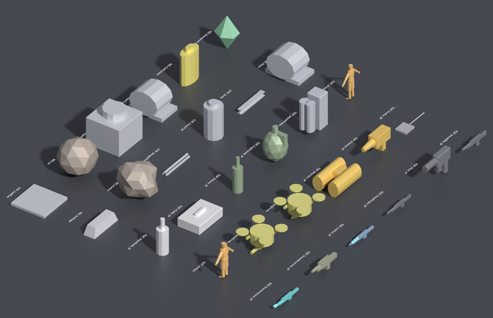

# 20 — Blender Toolkit & Art Pipeline

> `tools/blender/exodus_parts.py` turns every card in this bible into a Blender file, builds a complete greybox of every part, checks work against the budgets, and exports it for the engine. Tested with Blender 4.2 (the `bpy` 4.2 module) on all **601 assets**: 446 block assets and 155 prop files (components, resources, equipment, suits, suit modules and drones).

**Every part is already built.** `assets/parts/` and `assets/props/` hold a validated greybox `.blend` for every asset in this bible (generated with `build --all`). Each one is at final size and budget, with LODs, collision, sockets, construction stages, moving parts and rigs, so the game can be assembled and played before final art arrives. Artists replace the greybox meshes one asset at a time and keep the names, pivots and sockets.


*Two parts from each category, built by `exodus_parts.py build` (sizes normalized for the sheet). Emissive panels glow only on parts whose card lists emissives; doors, discs and turret heads are separate moving-part meshes.*



*Props: weapons (3P and rigged 1P), tools, drones with rotor bones, suits on the player skeleton, suit modules, throwables, consumables, components, ores, ingots and fuels.*

## 20.1 Pipeline at a glance

```
 catalog (tools/parts/catalog/*.py)
        │  python3 tools/parts/build.py
        ▼
 docs/parts-bible/*.md  +  data/parts.json, components.json, equipment.json  +  data/art_tracker_*.csv
        │  exodus_parts.py build --all          (already run: every asset is in the repo)
        ▼
 assets/parts/<category>/<asset>.blend          assets/props/<family>/<asset>.blend
        │  artist replaces greybox meshes → exodus_parts.py validate   (repeat until PASS)
        ▼
 exodus_parts.py export
        ▼
 export/parts/<category>/<asset>.fbx (+ _BuildStages, _Parts, .meta.json)
 export/props/<family>/<asset>.fbx (+ .meta.json)                          →  engine import
```

`export/` is a build output and is not committed (see `.gitignore`); regenerate it at any time.

## 20.2 Commands
Run from the repository root. `blender -b -P` runs Blender in the background; everything after `--` goes to the tool.

| Task | Command |
|---|---|
| **Build everything** (446 blocks + 155 props, ~35 s) | `blender -b -P tools/blender/exodus_parts.py -- build --all` |
| Build one asset / part / category | `… -- build --asset SM_PWR_Battery_LG` · `--part PWR-010` · `--category LIF PRO` |
| Build every prop | `… -- build --props` |
| Build props by item id | `… -- build --prop multitool assault_rifle iron_ore` |
| Starter file only (no greybox) | `… -- scaffold --asset SM_STR_ArmorBlock_Light_LG` (same selectors as `build`) |
| Overwrite an existing file | add `--force` (off by default: artists' files are never replaced by accident) |
| Validate files | `… -- validate assets/parts/power/SM_PWR_Battery_LG.blend [more.blend …]` |
| Validate everything | `… -- validate $(find assets/parts assets/props -name '*.blend')` |
| Export (validates first) | `… -- export assets/props/equipment/firearm/SK_EQP_Pistol_1P.blend` |
| List assets and budgets | `… -- list --category SOW` · `… -- list --props` |
| Other data or output location | `--data path/to/parts.json`, `--out path/to/root` |

The script also runs with the stand-alone `bpy` Python module: `python tools/blender/exodus_parts.py build --all`.

**Inside Blender:** open `exodus_parts.py` in the Text Editor and press **Run Script**. An **EXODUS** tab appears in the 3D View sidebar (`N`) with an asset-name field and **Scaffold Asset** / **Validate Scene** buttons.

## 20.3 Block assets: what a file contains
Every block file (`build` or `scaffold`) contains:

| Item | Details |
|---|---|
| **Scene units** | Metric, meters, unit scale 1.0 |
| **Root empty** `<asset>` | At the origin; custom properties: part ID, registry ID, grid, size, dimensions, tier, art set, complexity, LOD budgets, build stages, collision limit, mount and airtight faces, texel density, blockout shape (`greybox` version after a build) |
| **Collision** | `UCX_<asset>_01` matching the part's shape (split it into ≤ N hulls for final art) |
| **Sockets** | Every `SOCKET_*` the card lists, on the right face, +X pointing out |
| **Mount markers** | `MOUNT_<Face>` for each mount face, with an `airtight` flag |
| **Moving-part pivots** | `PART_*` empties with the motion text from the card |
| **Reference** | `REF_<asset>_Volume` (exact grid volume, wireframe) and `REF_Human_1p8m` |
| **Notes** | A text block `EXODUS_NOTES` with the card's function, modeling notes, budgets, moving parts, emissives and VFX |

`scaffold` stops there, with a plain LOD0 blockout and empty LOD1–3 and build-stage collections. **`build` adds the full greybox:**

| Greybox item | How it's generated |
|---|---|
| **LOD0** | The part's shape (cube, slope, corner, 2×1 pieces, round pieces, panels, walls, flat plates, cylinders) cut into a panel grid (1 cell for Simple parts, ½ cell for Standard, Complex and Hero), with 2-segment bevels on hard edges and recessed panels. Parts whose card lists emissives get one glowing front panel. The first detail level that fits the budget is used. |
| **LOD1–3** | 1-segment bevels → bare shape → minimal shape (a 5–6-sided cylinder or a box for LOD3), each checked against its budget |
| **Build stages** `<asset>_BS1…BSn` | BS1 is the construction frame (the 12 edge struts of the grid volume). Each later stage adds the body, filled up to *(k−1)/n* of its height (or its length, for flat parts), with a filled cut face. |
| **Moving parts** `<asset>_Part_*` | By the motion on the card. Doors, hatches, shutters, ramps and flaps become slabs on the front face, hinged on the correct edge. A second door goes on the back face, so an airlock gets its outer and inner doors. Fans, rotors, drums and rings become discs. Turrets get a yaw turntable, a pitch cradle and a barrel. Anything else becomes a block on top, with each part in its own lane. The body shrinks to make room, so parts stay inside the grid volume. |
| **Materials** | `MI_<SET>_Greybox_<CAT>` (category color), `MI_<SET>_Emissive_<CAT>` and `MI_<SET>_BuildFrame` |
| **UVs** | Box-projected UV0 `UVMap` and UV1 `Masks` on every mesh |

## 20.4 Props: what a file contains
Props come from `components.json` and `equipment.json` and follow the prop rules in chapters 17–18.

| Family | Files | Contents |
|---|---|---|
| Components `SM_CMP_*` · resources `SM_RES_*` | `assets/props/components/`, `assets/props/resources/` | LOD0 + LOD1 (50%). Shapes by type: plates, tubes, girders (I-beam), cells, motors, reactor cores, planks, sheets, rock chunks (ores and ice), ingots, wafers, canisters, fuel rods, crystals, sample jars. **Pivot at the base center.** |
| 1P viewmodels `SK_EQP_<Name>_1P` | `assets/props/equipment/<kind>/` | One LOD at the 1P budget, an `Armature` with every bone on the card (`root` at the grip; `mag`, `slide`, `bolt`, `pump`, `trigger`, `rotor_01…` and so on at their parts), every vertex weighted, and the card's sockets (`SOCKET_GripR` at the origin, muzzle and emitter at the front, sight on top, eject on the right). |
| 3P world models `SM_EQP_<Name>_3P` | same | LOD0–2 (100 / 50 / 20%), single mesh, pivot at the grip, same sockets |
| Suits `SK_SUIT_<Name>` | `assets/props/equipment/suit/` | The player's UE5-compatible skeleton (74 bones) from the character toolkit, scaled to the suit's height; a skinned body proxy thickened to the suit's bulk; LOD0–2; sockets on bones (helmet on `head`, backpack or jetpack on `spine_05`, module slots on the torso and limbs). Characters face −Y. |
| Suit modules and drones | `assets/props/equipment/suit-module/`, `…/drone/` | LOD0–2; drones get a body, arms, four rotor discs on `rotor_01…04` bones and their tool (drill, welding arm, gun yaw/pitch, camera). Module pivot at the base, drone pivot at the center. |

## 20.5 Validation rules

**Block assets**

| Check | Result if it fails |
|---|---|
| Exactly one root empty; at the origin with no rotation or scale | **Error** |
| Scene units Metric, scale 1.0 | **Error** |
| `<asset>_LOD0` exists | **Error** (LOD1–3 missing: warning) |
| Rotation and scale applied on LOD meshes | **Error** |
| Triangles ≤ budget | Over by > 10%: **error**; over by ≤ 10%: warning |
| UV0 present | **Error**; missing UV1 `Masks` on LOD0/1: warning |
| Materials named `MI_*`, no empty slots | **Error**; scaffold blockout material still on LOD0: warning |
| LODs inside the grid volume (±2 mm) unless the root has `allow_overhang` | **Error** |
| Collision hulls: at least 1, at most the card's limit | **Error** |
| Every socket required by the card exists | **Error** |
| Build-stage collections exist | **Error**; empty stage: warning |
| Size still matches the catalog (catches catalog changes) | **Error** |
| Object names follow the convention | Warning |

**Props**

| Check | Result if it fails |
|---|---|
| Units, root at the origin | **Error** |
| Every LOD for the family exists; triangles ≤ budget (10% tolerance as above) | **Error** |
| UV0 and `MI_*` materials | **Error** |
| LOD0 size matches the catalog within 3% (suits: height within 5%) | **Error** |
| Pivot rule: base center, grip (origin inside the prop), center (drones), or feet on Z = 0 (suits) | **Error** |
| Every socket on the card exists | **Error** |
| `SK_` props: armature present with every listed bone; Armature modifier; no unweighted vertices | **Error** |

`validate` exits with code 1 when any file has errors, so it can run in CI or a pre-commit hook. **Current status: 601 / 601 PASS with no warnings.**

## 20.6 Export outputs
`export` refuses to run on a file with validation errors, then writes:

| File | Contents |
|---|---|
| `<asset>.fbx` | Blocks: LOD0–3, `UCX_` collision, `SOCKET_` empties. Props: LODs, sockets and (for `SK_`) the armature, deform bones only. |
| `<asset>_BuildStages.fbx` | Blocks: BS1…BSn meshes |
| `<asset>_Parts.fbx` | Blocks: `PART_` pivots with their `<asset>_Part_*` meshes |
| `<asset>.meta.json` | Root metadata, sockets (world transforms), mounts (airtight flags), moving-part pivots; for props also bones, pivot rule and socket bones, for the engine's definition importers |

FBX settings: selection only, *Apply Unit Scale*, *FBX Units Scale*, face smoothing, modifiers applied, no leaf bones, no animation. Import settings are in [00 §0.3](00-blender-modeling-standards.md). A full export of all 601 files takes about 15 s and writes 1,194 FBX files plus 601 sidecars.

## 20.7 Production tracking
- `data/art_tracker_parts.csv` has **one row per block asset** (446 rows): budgets, faces, sockets, paths, plus `status`, `owner` and `notes` columns for production.
- `data/art_tracker_props.csv` covers components, resources, equipment, suits and drones.
- `status` is filled in by `tools/parts/build.py`: **Greybox built** when the asset's `.blend` files exist, otherwise *Not started*. Every row currently reads *Greybox built*.
- Import either CSV into a spreadsheet (Google Sheets, Excel, ShotGrid, Jira) as the art backlog. Suggested statuses after greybox: *High-poly → Low-poly → UV/Texture → Stages & LODs → Validated → In engine → Done*.

**Suggested production order for final art** (matches the vertical slice in the game bible, chapter 15):
1. Survivor Scrap set and Act I parts (Tier T0): Scrap Wall, Barricades, Workbench, Diesel Generator, Floodlight, Campfire.
2. Armor shape family (Light), Doors, Catwalks, Windows: everything that's placed thousands of times.
3. Wren launch hardware (Capsule Cockpit, Methalox Engine, Launch Clamp) for M1.07.
4. The Multitool and Act I weapons (1P first: they are on screen 95% of play).
5. Life support and colony furniture for Act II.
6. Ships (thrusters, cockpits, tanks), then precursor hero parts.

## 20.8 Replacing a greybox with final art
1. Open the asset's `.blend`. Model the final mesh as `<asset>_LOD0` (keep the name), then LOD1–3, the build stages and the `<asset>_Part_*` meshes.
2. Keep the root empty, `UCX_`, `SOCKET_`, `MOUNT_` and `PART_` objects: move them if the art demands it, but don't rename them.
3. Swap `MI_<SET>_Greybox_<CAT>` for the art set's master materials ([19](19-materials-and-art-sets.md)).
4. `validate`, then `export`.

## 20.9 Adding or changing a part
1. Edit the right module in `tools/parts/catalog/` (for example, add a `P("PWR", "Geothermal Tap", …)` call to `blocks_systems.py`), or `components.py` / `equipment.py` for props.
2. Run `python3 tools/parts/build.py`. It validates the catalog (unknown recipe items, faces, socket types, duplicate names) and regenerates every chapter, JSON and CSV.
3. Build the new asset: `blender -b -P tools/blender/exodus_parts.py -- build --part PWR-014` (or `--prop <item id>`), then rerun `build.py` so the tracker shows it as built.
4. If a size changed on an existing part, `validate` flags the old file: rebuild it with `--force` if it is still a greybox, or re-scaffold into a new file and move the final art across.

New parts get the next ID in their category. IDs are assigned in catalog order, so **add new parts at the end of their category** to keep existing IDs stable.
