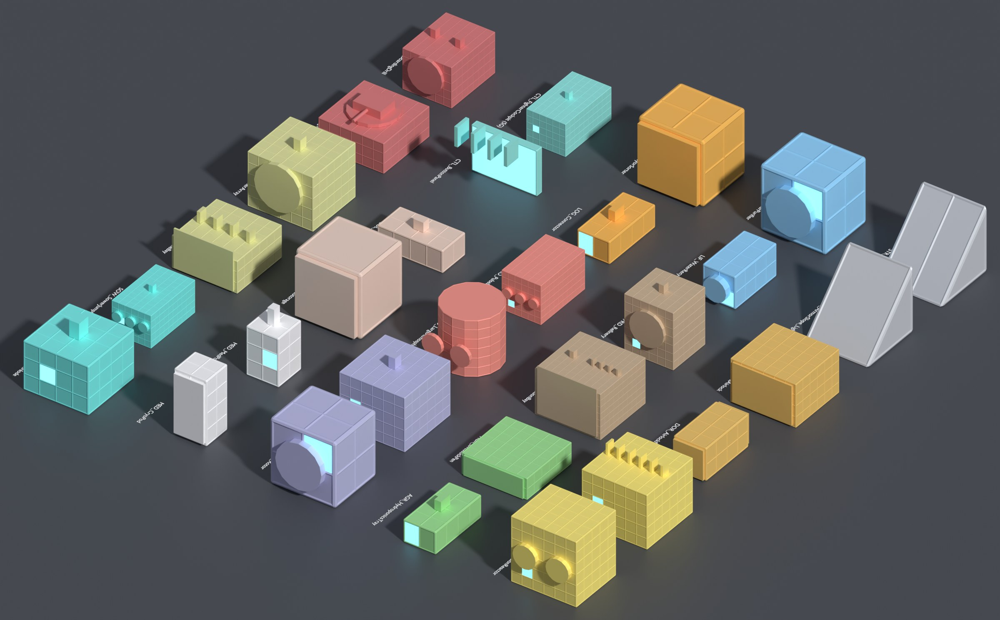

# EXODUS PROTOCOL — Parts Bible

> Every buildable part, component, tool, weapon, suit and drone in the game, with gameplay stats and a **Blender production spec for each asset**. Companion to the [Game Bible](../game-bible/README.md) (see its chapters 06 Engineering & Building and 22 Balance & Tuning). Characters, creatures and enemies are in the [Character Bible](../character-bible/README.md).

<!-- STATS:START -->
| | Count |
|---|---|
| Buildable parts | **237** across 15 categories |
| Block assets (per grid × variant) | **446** (299 large grid, 147 small grid) |
| Components | 30 |
| Resources, ingots & fuels | 27 |
| Handheld equipment, suits, modules & drones | 57 items (98 assets) |
| **Total Blender assets** | **601** |
<!-- STATS:END -->

## How to use this bible
- **Designers:** the [Master Parts List](01-master-parts-list.md) is the full catalog; each category chapter has a detail card per part with size, mass, integrity, power, recipe, tier and unlock.
- **3D artists:** each card lists every Blender asset with exact dimensions, triangle budgets for LOD0–3, construction stages, collision limits, required sockets, moving-part pivots, emissives, VFX and modeling notes. Read [00 — Blender Modeling Standards](00-blender-modeling-standards.md) first. **Every asset is already built as a validated greybox** in `assets/parts/` and `assets/props/` (see the [Blender toolkit](20-blender-toolkit.md)): open the file and replace the greybox with final art.
- **Producers:** `data/art_tracker_parts.csv` and `data/art_tracker_props.csv` are ready-made art backlogs (one row per asset, with status and owner columns).
- **Engineers:** `data/parts.json` is the machine-readable registry (it matches the data-driven design in game bible chapter 13); `data/components.json` and `data/equipment.json` cover items.

## Chapters

| # | Chapter | Contents |
|---|---|---|
| 00 | [Blender Modeling Standards](00-blender-modeling-standards.md) | Units, axes, pivots, naming, collections, grid fit, budgets, LODs, UVs, materials, stages, damage, collision, sockets, rigs, definition of done |
| 01 | [Master Parts List](01-master-parts-list.md) | Every part in one list, with counts by category and tier |
| 02 | [Structure & Armor](02-structure-and-armor.md) | 16 armor shapes (Light/Heavy), walls, beams, catwalks, windows, interiors |
| 03 | [Doors & Access](03-doors-and-access.md) | Scrap doors to vehicle airlocks, blast doors, hangar doors, elevators |
| 04 | [Power & Thermal](04-power-and-thermal.md) | Diesel to fusion, batteries, radiators, heat sinks, breaker panel |
| 05 | [Life Support](05-life-support.md) | Water, oxygen, ducts, scrubbers, spore filters, heaters |
| 06 | [Production & Research](06-production-and-research.md) | Workbench to Fabrication Bay, research stations |
| 07 | [Agriculture](07-agriculture.md) | Planters, hydroponics, algae, protein vats, Tessari pens |
| 08 | [Logistics & Storage](08-logistics-and-storage.md) | Conveyors, sorters, containers, connectors |
| 09 | [Propulsion, Flight & Launch](09-propulsion-flight-and-launch.md) | Thrusters, wheels, landing gear, wings, drives, tanks, the Wren's launch hardware |
| 10 | [Mechanical](10-mechanical.md) | Rotors, hinges, pistons, merge blocks, habitat ring bearing |
| 11 | [Control & Automation](11-control-and-automation.md) | Seats, cockpits, consoles, logic blocks, screens |
| 12 | [Colony & Furniture](12-colony-and-furniture.md) | Beds, dining (the Sunday table), kitchens, hygiene, recreation, chapel, memorial wall, decor |
| 13 | [Medical](13-medical.md) | Med-Pod, surgery, quarantine, bio-scanner, cryo |
| 14 | [Defense & Weapon Systems](14-defense-and-weapon-systems.md) | Barricades, traps, turrets, ship weapons, boarding drill |
| 15 | [Utility, Sensors & Lighting](15-utility-sensors-and-lighting.md) | Lights, antennas, beacons, scanners, signal decoder, drills, suit station |
| 16 | [Precursor (Sower)](16-precursor-sower.md) | Jump core, Loom node, resonance tech, living hull |
| 17 | [Components & Resources](17-components-and-resources.md) | Crafting components, ores, ingots and fuels, each with a prop spec |
| 18 | [Handheld Equipment, Suits & Drones](18-handheld-equipment-and-suits.md) | Tools, every weapon, throwables, consumables, suits, suit modules, drones |
| 19 | [Materials, Art Sets & Faction Skins](19-materials-and-art-sets.md) | Art-set palettes, trim sheets, faction skins, master materials |
| 20 | [Blender Toolkit & Art Pipeline](20-blender-toolkit.md) | Build (full greybox of all 601 assets), scaffold, validate and export commands; what each file contains; production tracking; replacing greybox with final art |

## Built assets
All 601 assets are built in Blender and pass validation: `assets/parts/<category>/` (446 block files) and `assets/props/` (155 prop files). Each greybox is at final size and budget, with LOD0–3, collision, sockets, mounts, construction stages, moving parts and, for weapons, suits and drones, rigs. Rebuild them with `blender -b -P tools/blender/exodus_parts.py -- build --all --force`.

## Source of truth
Chapters 01–18 and everything in `data/` are **generated** from `tools/parts/catalog/` by `python3 tools/parts/build.py`. Change the catalog, not the generated files. Chapters 00, 19 and 20 and this README are hand-written; the counts table above is refreshed by the build.

## Conventions in one breath
Large grid cell 2.5 m, small grid cell 0.5 m · sizes are W×H×D cells · front +X, up +Z, left +Y · pivot at the grid-volume center · assets named `SM_<CAT>_<Name>[_<Variant>]_<LG|SG>` · power in kW (+ generates, − draws) · tiers T0 (Act I scavenging) → T5 (post-game).
