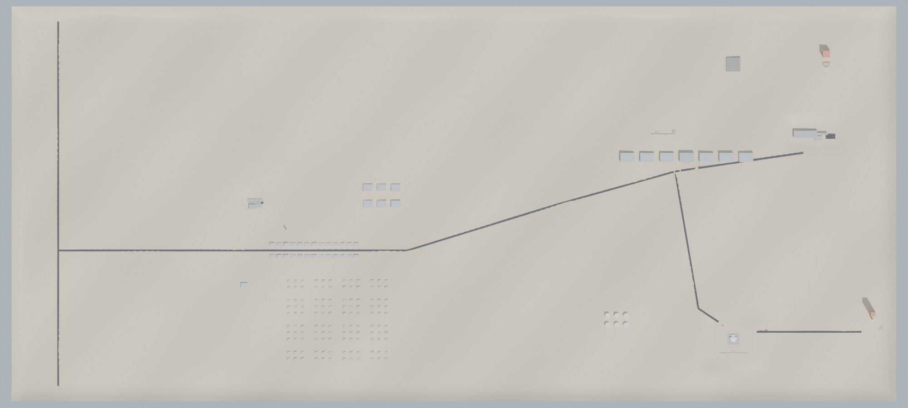

# Apex_Project: EXODUS PROTOCOL vertical slice (Unreal Engine 5.8)

A playable greybox prototype of the vertical slice from [game bible 15.4](../../docs/game-bible/15-production-plan.md): the **Cold Open, M0.01 to M0.03, M1.01 and M1.02**. It is set in a 3.8 × 1.7 km cut of Kestrel Valley that contains the Kestrel Complex (Mission Control, Hangar 4, the service corridors, Terminal B and Pad 12), Kestrel Township with Kestrel Elementary, and Route 93.

*Top-down view of the generated layout: Route 93 on the left, the Township and suburbs in the middle, and the Kestrel Complex, Terminal B and Pad 12 on the right.*

Everything is code plus data. The C++ module holds the game systems. On the first editor start, a Python script imports the committed FBX files and builds the map from `slice_layout.json`. **You do not need Blender.**

## Install into `D:\Apex_Project`

**You need:**
- **Unreal Engine 5.8**, installed from the Epic Games Launcher.
- **Visual Studio 2022** with the *Game development with C++* workload. Also install the *.NET desktop development* workload if Unreal asks for it.

1. Copy this folder so that `D:\Apex_Project\Apex_Project.uproject` exists. If you already have a `D:\Apex_Project`, copy over it: the project's own folders (`Source`, `Config`, `Content/Python`, `Content/Exodus/Data`, `SourceArt`) use these names.
2. Right-click `Apex_Project.uproject` and choose **Generate Visual Studio project files**.
3. Open `Apex_Project.sln`. Choose the configuration **Development Editor | Win64** and build (**Ctrl+Shift+B**). Or double-click the `.uproject` and click **Yes** when it offers to build the missing modules.
4. Open `Apex_Project.uproject`. **The first start builds the slice by itself**, which takes a few minutes:
   - It imports 9 parts, 14 characters and their 105 animations from `SourceArt/` into `/Game/Exodus/Imported/`.
   - It creates the greybox materials.
   - It places the terrain, 600 greybox blocks, 97 gameplay actors, the sky and the sun into `/Game/Exodus/Maps/L_VerticalSlice`.
   - It builds the navmesh, then saves the map.

   A dialog tells you when the build is done. If you need to run it again, use the **Exodus** menu in the main menu bar: *Build Vertical Slice (import + map)* or *Rebuild Map Only*.
5. Press **Play** (Alt+P). The slice starts at the Cold Open.

## Controls

| Action | Keyboard / mouse | Gamepad |
|---|---|---|
| Move / look | WASD / mouse | Left / right stick |
| Sprint (12 stamina/s) | Left Shift | L3 |
| Crouch (quiet) | Left Ctrl | B / Circle |
| Jump | Space | A / Cross |
| Wrench (35 damage, head hits count as weak points) | LMB | RT |
| Interact | E | X / Square |
| Build mode on/off | B | D-pad up |
| In build mode: place a frame (LMB), hold LMB to weld, hold RMB to grind | LMB / RMB | RT / LT |
| Rotate part / next part | R / mouse wheel | — / RB |
| Helmet light | L | D-pad right |
| Use a Suppressant (−10% infection, halts it for 20 min) | H | D-pad left |
| Skip a dialogue line | Enter | — |

The HUD shows:
- the vitals bars: health, stamina, hunger, thirst and infection
- a green infection vignette, and the Turning countdown at 90% infection
- the objective and subtitles
- the clock and Attraction
- the build panel, with each part's cost in components

## What you play

| Step ids (for `ExoJump`) | Mission | Beats |
|---|---|---|
| `c0_intro` … `c0_cut` | **Cold Open: Contact** (Mission Control, 2068) | Guide the Persephone drill; the surface flinches; Mara: "...Did it just move?"; Crane: "You just touched history." Then THREE YEARS LATER |
| `m001_panel` … `m001_codeblack` | **M0.01 Last Shift** (Hangar 4) | Weld the Wren's panel, Ada's call, Tug and his coffee, Dana waves goodnight, Code Black |
| `m002_dark` … `m002_free` | **M0.02 Code Black** (service corridors) | First Hollow (Dana), the scratch, the med cabinet and first Suppressant, the parts cage, the forklift rescue |
| `m003_call` … `m003_title` | **M0.03 The Promise** (Terminal B, Pad 12, Hangar 4) | Concourse, barricaded gates, baggage handling, skywalk collapse, apron, Pad 12 standoff (Ada and Crane on the radio), weld the hangar doors under horde pressure, the roof. Title card: **EXODUS PROTOCOL** |
| `m101_workbench` … `m101_radio` | **M1.01 Four Walls** | Build a Workbench, a Generator and a Floodlight; survive the first horde night (runs at 4× time); the distress call |
| `m102_call` … `m102_sad` | **M1.02 The Girl in the Walls** (Kestrel Elementary) | Ms. Alvarez at the whiteboard; Lily in the vents; the gym horde (18 Shamblers, 4 Crawlers) split by the fire alarm; a Runner pack of 3 at the exit; the campfire. "Are they sad?" |

Travel between the separate mission spaces uses teleports with a title card. For example, the corridors are entered through a teleport from the hangar, and after the apron you are moved to the Pad 12 approach. Inside each space you walk. Floor changes use stairs and ladders you interact with (E).

## Debug

Open the console with the backtick key (`). The game mode runs these commands:

| Command | Effect |
|---|---|
| `ExoJump m003_weld` | Jump to any step id (see the table above). The world state of the earlier steps is replayed |
| `ExoTime 19.5` | Set the time of day (night is 20:00 to 04:00; every 3rd night is a Green Moon) |
| `ExoHorde 20` | Spawn a horde from hidden `HS_` zones at least 60 m away |
| `ExoGive 200` | Add components |

You can also launch straight into a step: `UnrealEditor.exe D:\Apex_Project\Apex_Project.uproject -game -ExoStep=m102_school`. `LogExodus` in the Output Log reports each mission step, horde spawns and import results.

## How it is built

| Path | What it is |
|---|---|
| `Source/Apex_Project/` | The C++ game (UE 5.8, Enhanced Input set up in code, no Blueprints needed). It contains: the player (`ExoPlayerCharacter`), vitals and infection (`ExoVitalsComponent`), building (`ExoBuildComponent`, `ExoBlock`), Hollows and their AI (`ExoHollow`, `ExoHollowAI`), noise (`ExoNoiseSubsystem`), the data-driven missions (`ExoMissionSubsystem`), the day and night cycle, hordes and checkpoints (`ExoGameMode`), companions with needs (`ExoCompanion`), character animation (`ExoAnimComponent`), interactables, markers, spawners, the terrain and the HUD. The numbers come from game bible 22 (Balance & Tuning) |
| `Source/Apex_Project/Public/ExoAnimComponent.h` | Plays each character's animation set with no Animation Blueprint. Characters stand in Idle, or play Talk while their dialogue line or bark is on screen. When they move, it picks the gait closest to their speed (Walk, Jog or Sprint; Hollows Walk or Run) and scales its play rate so the feet match the ground. Attack, HitReact, Death and Wave play once on top. Hollows play their Death clip instead of ragdolling. Missions can stage a clip with `{"do": "anim", "companion": "Tug", "anim": "Wave", "seconds": 2}` |
| `Content/Exodus/Data/animations.json` | Each slice character's clips: loop flag, length and ground speed. Written by `export_slice_art.py`, read at runtime |
| `Content/Exodus/Data/missions.json` | Every mission step: its objective, the actions that run when it starts, and the event that completes it. Edit this file and press Play; no rebuild is needed |
| `Content/Exodus/Data/slice_layout.json` | The generated map: terrain heights, greybox boxes and gameplay actors, in UE centimetres |
| `Content/Python/exodus_ue/planner.py` | Builds `slice_layout.json` from the level bible: the Kestrel Valley terrain, the room layouts and markers of the Blender level exports (`SourceArt/levels/*.markers.json`), plus the hand-placed gameplay in `slice_extras.py`. Pure Python: `python3 Content/Python/exodus_ue/planner.py` |
| `Content/Python/exodus_ue/validate.py` | Checks every marker, group, companion, trigger, interactable, part, kill target and animation clip used in `missions.json` against the layout and `animations.json`, and that every character in the layout has an animation set. Exits with code 1 on any error |
| `Content/Python/exodus_ue/exodus_setup.py`, `Content/Python/init_unreal.py` | The editor build (import, materials, map, navmesh, save) and the Exodus menu |
| `SourceArt/Parts`, `SourceArt/Characters`, `SourceArt/Animations` | FBX files exported from the repo's Blender assets (LOD0; parts include their `UCX_` collision; one compact FBX per animation clip, from `assets/animations/`, see [character bible 13](../../docs/character-bible/13-procedural-animation-toolkit.md)). To regenerate them: `blender -b -P unreal/Apex_Project/SourceArt/export_slice_art.py`, or add `-- anims` for the animations only |

**Coordinates:** the level bible uses metres with +X east, +Y north and +Z up. The map uses UE centimetres with Y flipped: `UE = (x, −y, z) × 100`.

## Known limits (it's a greybox prototype)

- **Not yet compiled or run in Unreal.** It was written and checked without an Unreal install:
  - the C++ was syntax-checked against a stand-in for the engine headers;
  - the Python build script was dry-run against a mock of the editor API, which checked every property name it sets;
  - the layout was rendered and inspected in Blender;
  - the mission data was cross-checked by `validate.py`.

  Expect a few compile or editor-API fixes on the first real build. `LogExodus` and the Python log say what failed.
- The characters are rigged greybox meshes with procedural greybox animations. The clips switch without blending, so gait changes pop, and there are no turn-in-place, starts or stops yet. If a mesh fails to import, a coloured cylinder stands in for it. If its animations fail to import, it holds its bind pose.
- The set pieces are simplified: the skywalk collapse and the Pad 12 departure are teleports plus dialogue, and there is no crowd simulation, fuel-truck explosion or cinematics yet.
- There is no audio or voice. Dialogue appears as subtitles.
